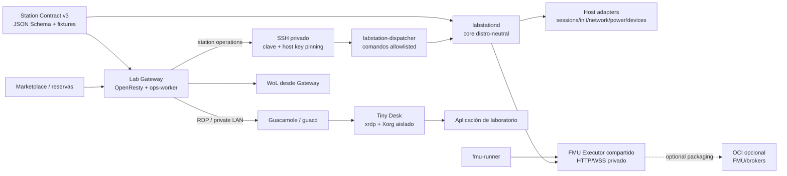

# PLAN: Lab Station equivalente para Linux

**Estado:** implementación funcional de Linux y de la integración básica con Gateway publicada; los CI Linux, Windows y Gateway están en verde. Aceptación global **parcial** y sin certificación de host/release. `supportTier` sigue en `unverified` hasta cerrar los gates de la sección 13.  
**Ámbito:** Lab Station Linux nativa, interoperabilidad Windows/Linux en Lab Gateway y FMU Executor compartido.  
**Fecha de revisión:** 2026-10-08.  
**Documento de partida:** `PLAN_LAB_STATION_LINUX(5).md`, revisión del 2026-10-07.  
**Referencia de código:** las cuatro instantáneas inmutables de la sección 0; no se ha sustituido ninguna de las ramas solicitadas por `main`.

## 0. Base de la revisión y lectura del documento

### 0.1 Instantáneas revisadas

| Repositorio | Rama | Commit de partida | Commit final de código publicado | Evidencia al revisar |
| --- | --- | --- | --- | --- |
| DecentraLabsCom/Lab-Gateway | feature/lab-station-linux | 55c736ef76fafe789d798677a61bfce357d42576 | 3d529d49079f69ab66e4696c93b1b86a87603410 | Publicado; Gateway Tests 37745348305: 15/15 jobs en verde. [G0] → [G9] |
| DecentraLabsCom/Lab-Station | feature/lab-station-linux | 5d5a49d4a511c1822e5d7a12285b9e8ef6aa2eac | a90aabf445530be78604eb2a74b03b57cf548ae7 | Publicado; Tests 37744081596, Security Scan 37744081620 y FMU dependency audit 37744081691 en verde. [W0] → [W4] |
| DecentraLabsCom/FMU-Executor | main | da574fe0c44cb087a52ea034837064c0b300c9e2 | da574fe0c44cb087a52ea034837064c0b300c9e2 | Sin cambios; repositorio independiente y única rama remota main. [F0] |
| DecentraLabsCom/Lab-Station-Linux | main | 43642185f5cfaa1db0d345b3d8b465d774f8f6d9 | 0dae623d5960fabb7f5d424776b957b681caf809 | Publicado; build 37744544036, CodeQL 37744544040 y govulncheck 37744544052 en verde. [L0] → [L13] |

Se conservan las ramas solicitadas: Lab Station Linux y FMU-Executor usan main;
Windows parte de fix/cooperative-appcontrol-close; Gateway usa
feature/lab-station-linux. FMU-Executor no se modificó ni se añadió como
submódulo: las Stations comparan snapshots con el repositorio independiente
[F0].

**Método y límite de evidencia.** Se contrastó el documento completo con código,
tests, README, workflows, commits y ejecuciones de GitHub Actions. Se separan
implementación, test local, CI remoto y certificación de host. Se añadió una
guía de canary. No se afirma instalación certificada en estación física, sesión
RDP/Guacamole real, ciclo WoL físico ni campaña completa de distribución.

**Evidencia local disponible.** Linux pasa go test -race -cover ./... con Go
1.27 y go vet ./... en contenedor Linux; la cobertura varía por paquete y no se
declara un 80% global. Los smokes de setup/instalación y builds portable/DEB/RPM
pasaron en la revisión anterior. Windows verifica localmente su snapshot FMU.
La suite AHK pasó sin el aviso EnsureDir. FMU-Executor dio 125 passed. En Gateway,
ops-worker pasó 1213 tests con 1 skip y 83.59% de cobertura en Python 3.13.5;
54 tests de transporte SSH/contrato pasaron por separado. El test dependiente de
MariaDB se omitió al no haber servicio local. Docker Desktop agotó sus pools CIDR
y no llegó a crear la red local; `real-compose-resilience` pasó en el runner
aislado con el commit final [CI-Gateway]. No se eliminaron redes ajenas.

**CI anterior a los commits de corrección.** Linux construyó paquetes, CodeQL y
análisis de vulnerabilidades, pero su test Go asumía que el runner era root; se
hizo portable. Windows detuvo pytest porque el verificador invocaba `tar.exe` en
Ubuntu; se cambió a `tar` portable. Gateway detectó que la imagen ops-worker no
copiaba `transports`; se añadió el paquete y se corrigió la expectativa de capas
Docker en el test. Las verificaciones finales de cada repositorio, ya verdes, se registran en
20.4.

### 0.2 Estado que sustituye las descripciones antiguas de "código actual"

| Área | Implementado y probado | Pendiente o límite actual |
| --- | --- | --- |
| Contrato común | Station Contract v3 y dispatcher v2 Linux/Gateway; schemas y fixtures de respuesta v2; bundle exacto con commit/hash, copiado a ambas Stations y validable por script; scenario matrix compartida por tests Windows/Linux [G7], [L13]. CI Linux/Windows/Gateway verde. | Windows conserva el flujo legacy sin leases. Falta prueba de inventario mixto instalado. |
| Transporte SSH | Paramiko, pinning, JSON por stdin, allowlist, límites por operación, IDs estables, consulta de operación y reconciliación de timeout; onboarding Linux prueba perfil, puerto, clave y trust preview [G7]. | Instalar una Station piloto, confirmar fingerprint fuera de banda y probar handshake real. |
| Núcleo Linux | Setup, helper de privilegio mínimo, CLI/daemon, cola, journal durable, lease/generación, recuperación fail-closed, perfiles y adaptadores systemd/OpenRC; go test -race -cover, go vet y CI (Go 1.23/estable, amd64/arm64, paquetes, CodeQL, govulncheck) pasan [L13], [CI-Linux]. | Servicio/UID/PAM en los hosts objetivo y certificación de la matriz de distribución. |
| FMU compartido | Windows y Linux fijan commit, árbol y payload runtime; snapshot verificado localmente y CI Windows Python 3.11/3.12/3.13 verde [W4], [L13], [F0], [CI-Windows]. | Faltan wheelhouse offline firmado, compatibilidad ABI por celda y reserva FMU real. |
| Tiny Desk | Setup genera perfil y entrada xsession root-owned; helper valida sesiones y lease delimita admisión/cleanup [L9]. | PAM/xrdp, Guacamole, app piloto, cgroups, cierre y coexistencia Wayland en host real. |
| Confinamiento FMU | Batch/stream usan proceso separado por defecto; realtime sigue dentro del proceso API [F1], [F2]. | Worker realtime aislado y sandbox de modelos hostiles no implementados en FMU-Executor; se difieren a un cambio del runtime. |
| Onboarding | Lab Manager permite seleccionar Linux/SSH, puerto/perfil/comando, almacena la clave privada cifrada, ofrece preview/confirmación de fingerprint y verifica identidad v3. Gateway tiene tests UI/API; puerto 0 explícito se valida correctamente. | Instalar la clave pública y confirmar fingerprint fuera de banda requiere operador y estación piloto. |
| Certificación y release | Bundles portables y DEB/RPM para amd64/arm64; build Linux, CodeQL, govulncheck y CIs de revisión/actualización de dependencias pasan [L13], [CI-Linux]. supportTier permanece unverified. | Matriz Ubuntu/Rocky/Leap/Devuan, hardware/GUI, firma y upgrade/rollback entre artefactos publicados. |

### 0.3 Hallazgos que cambian el orden de implementación

| ID | Hallazgo inicial | Estado después de la implementación | Evidencia que aún falta |
| --- | --- | --- | --- |
| H01 | Configuración de control y perfil de app no tenían una frontera legible coherente. | Perfil root-owned y estado/control separados; tests de permisos y ownership portables. | Instalar con servicios y UID reales en host. |
| H02 | Principal FMU compartía grupo/estado de control. | Usuario/grupo labstation-fmu independiente; units systemd/OpenRC con identidad propia. | Permisos bajo OpenRC y fuera de sandbox systemd. |
| H03 | Sudoers no autorizaba correctamente daemon/helper. | Política fija validada con visudo; separa labstation-ops → labstationd → helper/root. | Ejercicio positivo/negativo con usuarios reales. |
| H04 | El probe no podía conocer un secreto root-only sin leerlo. | Helper expone estado booleano; Gateway conserva escritura por stdin. | Token y llamada FMU autenticada con Gateway real. |
| H05 | Entrada X session editable y cleanup no asociado a lease. | xsession root-owned, workspace gestionado y admission/cleanup ligados a lease. | PAM/xrdp/RDP/cgroup y cierre de árbol real. |
| H06 | prepare/release no ligados a lease/generación durable. | Lease, generación, journal, idempotencia y recuperación implementados en Linux/Gateway. | Timeout/desconexión y release antiguo contra Station real. |
| H07 | Timeout de transporte podía confundirse con no ejecución. | Presupuestos, operation.status y reconciliación sin reejecución ciega implementados. | Corte SSH durante operación larga en host. |
| H08 | Identidad de sesión y revalidación tras gracia eran débiles. | IDs opacos y lectura de identidad antes/después del efecto cubiertos por tests. | logind/elogind y seats reales en ambos supervisores. |
| H09 | Pins por versión no probaban igualdad de bytes. | Linux/Windows fijan commit, árbol y payload runtime; snapshot Windows coincide; extracción usa tar portable; matrices CI Linux y Windows pasan. | Compatibilidad ABI por celda y wheelhouse offline firmado. |
| H10 | Upgrade gestionado no distinguía plantilla autorizada de deriva. | Migración hash anterior → nuevo y rechazo de deriva externa tienen tests. | Upgrade/rollback entre paquetes publicados en host real. |

Estos hallazgos describen riesgos deducidos de código; no son incidentes
observados en estaciones certificadas. No se relajan permisos ni se ejecuta el
agente como root para conseguir una prueba positiva.

### 0.4 Convención normativa

Las decisiones de las secciones 2, 4-12 y 18 son vinculantes. La sección 13
registra qué gates están parcialmente cerrados y qué trabajo queda; la 15
mantiene los criterios de aceptación con estado individual; la 17 separa lo
implementado de la evidencia pendiente por repositorio. Cuando se dice "debe",
es el objetivo del plan, no una afirmación de funcionamiento. No quedan
decisiones arquitectónicas abiertas para el núcleo Linux; los CI de código y
dependencias están verdes. Siguen pendientes las pruebas reales, la matriz de
soporte y la release.

## 1. Objetivo

Diseñar y construir una estación Linux equivalente a Lab Station que permita a
Lab Gateway preparar, servir, supervisar y liberar un puesto de laboratorio
físico o de simulación, sin intentar portar AutoHotkey, el Registro, WinRM o
las políticas de RemoteApp de Windows.

La implementación Linux será un **proyecto separado de Lab Station Windows**.
Ambos productos implementarán el mismo contrato operativo hacia Lab Gateway,
pero no se forzará una base de código común cuando las primitivas del sistema
operativo sean distintas.

La estación Linux debe cubrir estos casos:

1. Un puesto dedicado que expone una aplicación de laboratorio mediante una
   sesión remota mínima.
2. Un puesto híbrido que también puede ser utilizado localmente por un
   instructor, con aviso y desalojo controlado antes de una reserva remota.
3. Un puesto sin entorno gráfico previamente instalado que, si ofrece una
   aplicación gráfica, pueda crear su propia sesión remota mínima sin instalar
   un escritorio general.
4. Un puesto headless que ofrece únicamente ejecución FMU u otros servicios que
   no necesitan interfaz gráfica.
5. Una estación que puede despertarse por Wake-on-LAN, recibir órdenes
   allowlisted desde Lab Gateway, ejecutar acciones privilegiadas de forma
   controlada y publicar telemetría auditable.

### Requisito de portabilidad Linux

La arquitectura debe ser **independiente de la distribución y del escritorio
preexistente**. Una estación Debian, Ubuntu, Fedora/RHEL-compatible, openSUSE u
otra distribución soportada debe poder participar en el mismo inventario y
responder al mismo contrato sin que Marketplace, Lab Gateway o el usuario final
tengan que conocer diferencias de distribución.

Esto no significa prometer compatibilidad ciega con cualquier combinación de
kernel, init system, drivers o paquetes existente. Significa que:

- el núcleo no contendrá lógica de negocio ligada a `apt`, `dnf`, `systemd`,
  GNOME, KDE, Wayland o una distribución concreta;
- las diferencias del host quedarán detrás de adaptadores explícitos;
- la compatibilidad se decidirá por **capabilities detectadas**, no por el nombre
  de la distribución;
- el mismo contrato, formatos de estado y ciclo de reserva serán idénticos entre
  todas las distribuciones soportadas;
- una estación con escritorio instalado y una estación completamente headless
  deberán producir el mismo comportamiento de cara al Gateway para las
  capacidades que ambas anuncien.

El resultado no debe ser un “Windows para Linux”. Debe conservar la semántica
de operación que el Gateway necesita y sustituir cada dependencia específica
de Windows por la primitiva Linux más segura, portable y mantenible.

## 2. Resumen ejecutivo y decisiones vinculantes

### 2.1 Núcleo distro-neutral y matriz cerrada de certificación

Se mantiene el núcleo **Go nativo** para `labstationctl`, `labstationd`,
dispatcher y helper. No es ya una preferencia entre lenguajes: está implementado
en ese lenguaje [L1]. Se construira el agente con `CGO_ENABLED=0` cuando lo
permitan sus dependencias; CI comprobará los binarios resultantes. Esto no hace
estáticos Python, FMPy, Xorg, los drivers ni los binarios incluidos en una FMU.

La matriz objetivo de la primera release estable queda fijada así:

| Celda | SO de referencia | Arquitectura | Supervisor | Perfiles a certificar |
| --- | --- | --- | --- | --- |
| A, piloto y referencia | Ubuntu 24.04 LTS | `amd64` | systemd + logind | `fmu-only`, `dedicated`, `hybrid`; host sin GUI y GUI local |
| B, familia RHEL | Rocky Linux 9, menor soportada al congelar la release | `amd64` | systemd + logind | Los mismos perfiles; repositorios base y EPEL 9 aprobados |
| C, familia SUSE | openSUSE Leap 16.0 | `amd64` | systemd + logind | Los mismos perfiles, condicionados al gate de dependencias firmado |
| D, segundo supervisor | Devuan 6 Excalibur, imagen de ensayo con OpenRC y elogind | `amd64` | OpenRC + elogind/PAM | Gestion, cola y `fmu-only`; GUI permanece `unverified` hasta su propia campaña |

**La tabla fija objetivos, no declara compatibilidad ya certificada.** Ubuntu,
Rocky, openSUSE y Devuan son elecciones de este plan. Sus versiones y
repositorios se contrastaron con fuentes oficiales [E1], [E2], [E3], [E4], [E5]. La disponibilidad de
un paquete EPEL no prueba el conjunto completo de Tiny Desk. No se ha acreditado
en esta revisión una combinación xrdp/xorgxrdp completa para Leap 16.0: resolver
ese conjunto en repositorios aprobados es una tarea de G5, no permiso para
instalar paquetes de un repositorio personal arbitrario.

La release no publicará el claim de soporte de una celda fallida. Un piloto
Ubuntu puede entregarse antes como **preview de alcance limitado**, sin bloquear
el avance de las otras familias ni anunciar "Linux genérico". La estable
multifamilia requiere A+B+C y la evidencia no-systemd de D. Si un bloqueo externo
hace imposible una celda, se modifica expresamente la matriz de la release, no
se cambia silenciosamente el core ni se declara aprobado el test.

`arm64` se sigue construyendo, pero **no se certifica en la primera matriz**;
requiere su propio gate de wheels, FMU nativa, GUI y hardware. Debian 13 y Arch
son ampliaciones posteriores, no dependencias del piloto. No se elige Alpine
musl como primer host OpenRC: evitar introducir a la vez otro init y otra base
ABI simplifica la comparación.

Cada celda aprobada aportara un manifiesto con versión de imagen/ISO y digest,
kernel, Python, paquetes/repositorios y hashes, GUI, drivers y firmware relevantes,
commits de los cuatro proyectos, resultado de los tests y fecha. Las versiones
menores de seguridad se actualizan mediante reconstrucción y regresión, no se
congelan indefinidamente por aparecer en una tabla.

La adaptación sigue separada por dominios: supervisor, paquetes, sesiones/PAM,
red, firewall, WoL, energía, dispositivos y acceso remoto. La capacidad se decide
por evidencia detectada y probada, no por `ID` de `/etc/os-release`.

### 2.2 Administración remota

El transporte recomendado es SSH con:

- claves de servicio, sin contraseña;
- huella de host fijada por estación;
- usuario SSH sin acceso a shell interactiva;
- `authorized_keys` con `restrict` y `command=` forzado hacia un dispatcher;
- dispatcher que acepta únicamente operaciones estructuradas y allowlisted;
- separación entre el usuario SSH y las acciones privilegiadas locales.

SSH sustituye a WinRM como transporte, pero no autoriza a Lab Gateway a
ejecutar shell arbitraria. La superficie lógica seguirá siendo la del contrato
de estación (`prepare-session`, `release-session`, `status-json`, `power`,
`recovery`, etc.).

No se recomienda abrir un nuevo servidor HTTP público en la estación. Un agente
HTTPS con mTLS puede evaluarse como alternativa futura para redes en las que
SSH no sea viable.

### 2.3 Privilegios: helper Go y sudoers restringido

Se adopta **el helper Go existente, invocado por `sudo -n` mediante una ruta
absoluta fija**, con petición JSON por stdin y sin argumentos de shell [L3], [L7].
No se implementara en paralelo otro camino de polkit ni un daemon HTTP root.

El setup inicial requiere root y prepara usuarios, permisos, servicios, claves,
PAM/xrdp, reglas de red y WoL. El servicio ordinario sigue sin ser root y no
conserva una contraseña administrativa. Solo `labstation-ops` y `labstationd`
podrán invocar el helper, con operaciones diferenciadas y verificadas; `labuser`
y `labstation-fmu` no tendrán esa autorización.

El helper debe revalidar política local, identidad y pertenencia de cada sesión,
limitar todos los comandos a binarios/argumentos definidos, usar entorno saneado
y deadlines, y devolver resultados sin secretos. Los principios y permisos
exactos se fijan en 4.1 y 4.5. No se acepta `NOPASSWD: ALL`, ni `sudo sh -c`, ni
un helper que acepte rutas, usuarios o units arbitrarios.

### 2.4 Acceso gráfico independiente del escritorio existente

El equivalente inicial de RemoteApp será **Tiny Desk**, un componente incluido
en Lab Station Linux. Tiny Desk inicia una única aplicación de laboratorio en
una sesión Xorg/xrdp propia, sin entregar un escritorio general al usuario
remoto.

Esta arquitectura debe funcionar en dos extremos sin cambiar el contrato:

- **host headless**: el setup instala sólo Xorg/xrdp/xorgxrdp y las dependencias
  mínimas necesarias para Tiny Desk; no instala GNOME, KDE ni un escritorio
  completo;
- **host con GUI existente**: no sustituye el display manager, compositor,
  Wayland/Xorg local ni las preferencias del usuario. La sesión remota usa un
  display Xorg separado bajo `labuser`.

Por tanto, un escritorio local Wayland puede coexistir con Tiny Desk sobre
xorgxrdp. La aplicación remota no debe asumir acceso a `:0`, al seat físico ni a
la sesión gráfica del instructor.

La sesión debe ejecutar sólo el comando declarado, limitar redirecciones RDP,
cerrar todo el cgroup al terminar y publicar readiness específico de la
aplicación y del backend gráfico.

### 2.5 Contrato único con Gateway

Se conserva Station Contract **3.0.0** para status/heartbeat y la compatibilidad
Windows 2.0.0 en el normalizador. La rama Windows solicitada ya emite v3; no hay
que rehacer esa migración desde una rama anterior [G1], [W1].

La API canónica es `station`. Los valores wire de `management.transport` son
**`winrm` y `ssh`**, con `platform.os=windows|linux`; los nombres descriptivos
`windows-winrm`/`linux-ssh` no se introducen como otros valores del schema.

Se mantienen `0` exito, `1` completado con advertencia, `>=2` fallo; el ciclo
wake/prepare/acceso/release/power; readiness por capacidad; secretos internos de
FMU; y separación del estado operativo y el estado on-chain. Ya existe una
abstracción de transporte [G2], [G3]: se completa, no se crea otro scheduler.

Para proteger el lifecycle existe la capacidad negociada `reservation-lease-v1`
y el envelope dispatcher v2, separado de la versión del status. Linux y Gateway
lo implementan con lease, generación, ventana de ejecución y consulta de estado
[G7], [L9]. Windows aún no implementa esa capability; Gateway debe rechazar o
mantener su camino Windows compatible, sin enviarle semántica v2 no negociada.
Los tests actuales son de contrato/unitarios y no certifican una reserva real.

### 2.6 Repositorios y código compartido

Se mantiene la separación existente:

```text
DecentraLabsCom/
  Lab-Station                  # Windows: AutoHotkey / PowerShell / AppControl
  Lab-Station-Linux            # Linux: Go / adaptadores / Tiny Desk / packaging
  FMU-Executor                 # Python / FastAPI / FMPy compartido
  Lab-Gateway/
    contracts/station/v3/      # schemas y fixtures canonicos
```

La extracción de FMU Executor **ya ha ocurrido** [F0], [W2]. El trabajo restante es
consolidar el consumo del artefacto, no volver a extraerlo ni crear un segundo
runtime Python. Los snapshots generados para empaquetar estaciones son válidos
si son inmutables, trazables y comprobados; no se aceptan forks editados a mano.

Los pins de Windows y Linux contienen `repository`, `version`, `commit`, digest
del árbol de source y digest del payload runtime, con comparación de snapshot
implementada [W4], [L9]. La verificación local pasó. El snapshot no convierte
FMU-Executor en submódulo ni afirma que el ZIP Windows incorpore el sidecar
opcional documentado [W3]. Linux y Windows conservan supervisores específicos;
las correcciones del motor FMI continúan perteneciendo primero a `FMU-Executor`.

El bundle exacto de Gateway está copiado en ambas Stations, pinneado a un
commit inmutable y con SHA-256 por archivo. Los workflows de Linux y Windows
comparan las copias con ese commit; el verificador también funciona offline. El
bundle sirve para conformance tests y no se descarga al arrancar el agente.
Falta validar productores y consumidores desde artefactos instalados.

### 2.7 Contenedores: uso opcional, no arquitectura base

**No se ejecutará Lab Station completo dentro de Docker/Podman.** El agente debe
interactuar de forma controlada con sesiones PAM/logind, xrdp/Xorg, dispositivos,
udev, NIC/WoL, energía, reinicios y usuarios del host. Meter esas funciones en
un contenedor requeriría `--privileged`, host networking/PID namespace o un
número elevado de device mounts y capacidades, reduciendo seguridad y sin
eliminar las diferencias entre distribuciones.

El patrón será:

```text
Host Linux (nativo)
  labstationctl / labstationd / dispatcher
  Tiny Desk + xrdp/Xorg
  adaptadores WoL/energía/dispositivos
            |
            +-- FMU Executor nativo  [default]
            +-- FMU Executor OCI     [extension posterior, no primera release]
            +-- otros sidecars OCI   [opcional]
```

La primera release no distribuirá una imagen OCI oficial. En una extensión posterior, los contenedores pueden utilizarse como aislamiento opcional para FMU
Executor, brokers OPC UA u otros sidecars que no necesiten controlar el host.
Debe existir siempre una modalidad nativa para FMUs o aplicaciones que necesiten
bibliotecas, GPU o hardware local que no sea práctico pasar a un contenedor.

La ausencia de Docker/Podman no puede impedir instalar ni operar Lab Station.

## 3. Inventario de la funcionalidad Windows que debe cubrirse

La referencia es la rama Windows solicitada, commit [W0]: producto 3.5.8 y
schema 3.0.0 [W1]. La tabla conserva la equivalencia funcional; no afirma que
cada primitiva Linux esté ya implementada o validada. AppControl, RemoteApp,
WinRM y las primitivas Windows siguen en su repositorio. Sus garantías de
lifecycle deben comprobarse contra los tests del contrato y no por igualdad de
código con Linux.

| Capacidad Windows | Implementación revisada | Equivalente Linux previsto |
| --- | --- | --- |
| Setup guiado | Wizard AutoHotkey y PowerShell | `labstationctl setup` idempotente con adaptadores de distribución; UI opcional |
| RemoteApp | Política Windows + Guacamole Remote App | Tiny Desk sobre xrdp/Xorg propio; independiente del escritorio local |
| Control de aplicación | AppControl, WTS, HWND, cierre cooperativo | Supervisor de proceso/cgroup, SIGTERM -> timeout -> SIGKILL |
| Detección de sesión | `quser`, WTS, RDP | logind/PAM/xrdp mediante adaptador de sesiones |
| Preparación | Guardia, limpieza de `LABUSER`, cierre AppControl y FMU | Guardia de sesiones, Tiny Desk/cgroup, limpieza allowlisted y FMU |
| Liberación | Cierre cooperativo, logoff, limpieza, reboot opcional | Cierre de cgroup y sesión remota, limpieza, reboot opcional |
| Administración remota | WinRM HTTPS, certificado y cuenta local | SSH restringido, host-key pinning y dispatcher allowlisted |
| Cuenta de laboratorio | `LABUSER`, grupos RDP, lockdown | `labuser`, PAM/xrdp, grupos/dispositivos mínimos, sin SSH/sudo |
| Servicio | Scheduled Task | Adaptador de supervisor; systemd inicialmente, otros sin cambiar el core |
| Cola asíncrona | INI + service loop | Mismo contrato de cola/resultados con watcher portable |
| Diagnóstico | Registro, CIM, PowerShell, `powercfg`, WinRM | `/proc`, `/sys`, `ip`, `ethtool`, sesiones, supervisor y adaptadores de host |
| Wake-on-LAN | `powercfg` + driver | `ethtool`, NetworkManager/systemd-networkd u otro backend detectado |
| Energía | Plan Windows + shutdown/hibernate | `/sys/power`, logind/D-Bus o backend allowlisted |
| Recuperación | Reboot condicionado por readiness | Reboot condicionado por capabilities Linux y límites de frecuencia |
| Telemetría | status/heartbeat 2.0.0 con campos Windows | Contrato común v3, campos portables + extensiones por plataforma |
| FMU | Sidecar Python supervisado desde AHK | Mismo FMU Executor compartido, supervisado nativamente u OCI opcional |
| UI local | Panel/tray/wizard AutoHotkey | CLI obligatorio; UI local opcional y desacoplada del daemon |

### 3.1 Qué se comparte y qué se reimplementa

Se reutiliza **código** en FMU Executor y se reutilizan **contratos/fixtures** en
telemetría y operaciones. El resto comparte semántica y pruebas de aceptación,
pero se reimplementa con primitivas Linux.

No se creará una capa artificial `windows/`/`linux/` dentro del repositorio
actual sólo para decir que existe código común. La separación de repositorios
permite toolchains, releases, instaladores y ciclos de soporte independientes.

## 4. Arquitectura propuesta



### 4.1 Procesos, usuarios y grupos

Los nombres siguientes quedan fijos para el MVP; el setup detecta una cuenta
preexistente incompatible y aborta, en vez de apropiarsela o cambiar su UID.

| Identidad | Grupo de función | Acceso permitido | Prohibido |
| --- | --- | --- | --- |
| `labstation-ops` | `labstation` | Dispatcher SSH, control/estado, helper restringido | Shell remota, PTY, forwarding, secretos en argumentos |
| `labstationd` | `labstation` | Heartbeat, journal, cola, recuperación y helper restringido | Ejecutar la aplicación o FMU como agente |
| `labuser` | `labstation-lab` | Perfil de app no secreto, Xorg remoto y workspace del lease | Grupo `labstation`, helper, SSH, configuración de control, modelos/secretos FMU |
| `labstation-fmu` | `labstation-fmu` | Runtime, modelos permitidos y temporales FMU | Grupo `labstation`, cola, estado de reservas físicas, sudo/helper |
| Instructor / admin | Grupos existentes | Operación local conforme a política | Recibir nuevos privilegios por usar Tiny Desk |

`labstation-ops` conserva una shell de sistema ejecutable para que OpenSSH pueda
iniciar el comando forzado; **no obtiene shell interactiva**. Configurar
`/usr/sbin/nologin` indiscriminadamente impediría el camino de `ForceCommand`.
La restricción real es la política SSH validada, el wrapper root-owned y la
allowlist del dispatcher [L3], [E6].

Los ejecutables, perfiles, reglas y directorios ascendientes no serán escribibles
por `labuser`, FMU ni el usuario SSH. El helper es la única elevación permanente
permitida. Reparar red/WoL queda en setup o en operaciones administrativas
concretas; no se entrega a Gateway una función genérica de edición root.

### 4.2 Layout de instalación, estado y perfiles

Se mantiene FHS y se respeta el layout que ya pública el daemon: `status.json`
y `heartbeat.json` bajo `StateDir`, no un nuevo `data/telemetry` obligatorio [L5].
Las rutas son privadas de la estación; Gateway usa IDs de artefacto.

```text
/usr/bin/labstationctl
/usr/bin/labstationd
/usr/lib/decentralabs/lab-station/
  labstation-dispatcher            # wrapper root-owned
  labstation-dispatcher-bin
  labstation-helper               # wrapper root-owned
  labstation-helper-bin
  tiny-desk-session               # entrada grafica root-owned, a completar
/etc/decentralabs/lab-station/     # root:labstation 0750
  station.toml                   # control, root:labstation 0640
  secrets/                       # root:root 0700
    fmu-internal-token.env        # root:root 0600
/etc/decentralabs/tiny-desk/       # perfil no secreto; root:labstation-lab 0750
  app.toml                       # root:labstation-lab 0640
/var/lib/decentralabs/lab-station/data/
  status.json
  heartbeat.json
  session-guard-events.jsonl
  commands/{inbox,processing,processed,results}/
  leases/                        # estado durable privado, nuevo
  operation-journal/             # deduplicacion/reconciliacion, nuevo
/run/decentralabs/tiny-desk/      # proyeccion de admision, sin secretos
/var/lib/decentralabs/lab-workspaces/<lease-id>/
/var/lib/decentralabs/fmu-executor/fmu-data/
/opt/decentralabs/fmu-executor/
/var/log/decentralabs/lab-station/
```

Los ficheros nuevos no se presentan como existentes. `app.toml` es una proyección
instalada por root para el launcher; no se resuelve el problema haciendo todo
`station.toml` legible o agregando `labuser` al grupo administrativo. Los modelos
FMU no se almacenan bajo el home gráfico. Cada migración de layout conserva el
estado anterior hasta completar verificación y rollback.

### 4.3 Capa de adaptación del host

`labstationd` no debe invocar directamente `apt`, `systemctl`, `loginctl`,
`nmcli`, `firewall-cmd`, `ufw` o `ethtool` desde su lógica de negocio. Debe
resolver capabilities y operar mediante interfaces internas, por ejemplo:

```text
ServiceManager
SessionManager
RemoteAccessManager
NetworkManager
FirewallManager
WakeManager
PowerManager
DeviceManager
PackageDependencyManager
```

Cada adaptador debe devolver un resultado estructurado con `supported`,
`available`, `ready`, `issues` y, cuando proceda, `backend`. La ausencia de un
backend no se convertirá en éxito implícito.

### 4.4 Fronteras de repositorio

`Lab-Station-Linux` contendrá sólo el agente Linux, Tiny Desk, adaptadores y
packaging Linux. `Lab-Station` continuará siendo Windows. `FMU-Executor` tendrá
su propio versionado. El contrato `Station Contract v3` será consumido por los
tres proyectos y tendrá fixtures que permitan ejecutar contract tests en CI.

### 4.5 Política del helper y pruebas de permisos obligatorias

El helper mantiene stdin JSON, un solo objeto de hasta 8192 bytes y rechazo de
campos desconocidos/trailing data. Las operaciones quedan enumeradas:
terminación de una sesión autorizada, acciones sobre los dos servicios propios,
energía sujeta al gate de inactividad, provisión/borrado del token FMU y consulta
de **estado no secreto**. Los identificadores de sesión serán opacos y acotados,
validados por logind/elogind; no se supondra que siempre son numéricos.

Cada mutación vuelve a comprobar en el límite privilegiado UID, tipo, seat,
identidad de sesión y lease vigente cuando aplique. La política de desalojo de
instructor es local, root-owned y opt-in. Root, cuentas de servicio y SSH de
gestion no son candidatos. Un cambio de sesión durante la gracia inválida la
orden; no se termina una sesión reutilizando un ID sin verificarla.

Se instalaran reglas sudoers distintas para los dos consumidores autorizados,
con ejecutable fijo y sin argumentos adicionales; el helper verifica el caller
que sudo establece y su propia operación. El daemon no puede configurarse con
un bloqueo de elevación que haga imposible su llamada a `sudo -n`; se documenta
esta excepción concreta en su sandbox [E8]. FMU y la aplicación conservan
`NoNewPrivileges` o su equivalente cuando el backend lo soporte. No se relajan
sus restricciones para arreglar al daemon.

Los binarios auxiliares se resuelven durante setup a rutas absolutas
root-owned. El helper no confía en PATH, variables de aplicación, comandos de
reserva ni argumentos de unidad libres. Lleva deadline y cierre de sus hijos.

**Gate de permisos bajo identidades reales:** comprobar que `labuser` puede
leer su perfil e iniciar la app, pero no leer control/secretos/modelos ni escribir
cola; que FMU no puede leer/escribir el plano de control; que el daemon puede
procesar una operación privilegiada permitida; y que todos los usuarios
rechazados fallan incluso fuera del sandbox systemd. Probar también OpenRC:
los permisos Unix no pueden descansar solo en `ProtectSystem`.

## 5. Tiny Desk y control de aplicaciones

### 5.1 Perfil y entrada inmutable de la aplicación

El launcher no carga la configuración de control. Consume el perfil separado de
4.2, propiedad de root, de solo lectura para `labuser`. El esquema de ese perfil
se versiona dentro del paquete Linux; el ejemplo es el objetivo, no el parser
TOML completo disponible hoy:

```toml
schema_version = 1
id = "lab-app"
command = "/opt/lab/apps/controller"
args = ["--remote-session"]
user = "labuser"
close_timeout_seconds = 15
```

El perfil fija el ejecutable y sus argumentos. El consumidor remoto no puede
sustituirlos. Se validan resolución física, propietarios, ancestros, permisos y
symlinks. Las variables de entorno son allowlisted. El launcher comprueba su
UID efectivo y el lease activo antes de iniciar procesos. No basta con rechazar
que el ejecutable se llame `bash`: una aplicación de laboratorio puede abrir
procesos o archivos desde sus propias funciones.

La entrada gráfica se instala fuera del home, root-owned, y se fija en el
backend xrdp/sesman. Se deshabilitan las entradas de window manager y autostart
controladas por el usuario remoto para ese backend. No se aceptan como frontera
de seguridad una `.xsession` modificable por `labuser` ni comprobarla mediante
subcadenas [L3], [L6]. La admisión PAM/xrdp solo permite la cuenta del laboratorio,
una sesión física activa por estación y un lease preparado no vencido. No se
entrega la contraseña RDP al navegador.

El backend systemd asignara la aplicación y sus descendientes a una unidad de
sesión/cgroup identificado por lease, con límites y cierre completo. No se
considera equivalente únicamente `Setpgid`. Primero se intenta el cierre
cooperativo definido por el perfil, luego TERM, espera hasta 15 s y finalmente
KILL del conjunto permitido. La desaparición de la aplicación cierra su sesión
remota; un fallo no produce un escritorio general de fallback.

La limpieza usa un workspace nuevo por lease. No borra el home completo ni
archivos de instructor. App, WM y procesos de sesión se reconcilian después de
una caida. OpenRC no anunciara Tiny Desk certificado hasta aportar un backend
que demuestre la misma propiedad de seguimiento y limpieza.

### 5.2 Backend gráfico: headless y GUI existente

El backend inicial será `xrdp` + `xorgxrdp` + una sesión Xorg mínima propia de
Tiny Desk. La arquitectura **no depende de que el host tenga un escritorio
instalado**.

En un host headless, el instalador añadirá sólo las dependencias Xorg/xrdp y el
WM/launcher mínimo que requiera Tiny Desk. No debe instalar un escritorio
completo ni un display manager salvo que una aplicación concreta lo exija y el
operador lo acepte.

En un host que ya use GNOME, KDE, Xfce u otro entorno —incluido un escritorio
local Wayland— Lab Station no debe reemplazar ni reconfigurar la sesión local.
La conexión xrdp crea un Xorg separado para `labuser`, con configuración propia
y sin acceso implícito al display físico.

Requisitos:

- no usar `DISPLAY=:0` como supuesto de funcionamiento;
- no depender del compositor local ni de extensiones de GNOME/KDE;
- no instalar un segundo escritorio general sólo para esconderlo;
- declarar si la aplicación requiere GPU/DRI, cámara, audio u otro dispositivo
  y validar esa capability antes de anunciar readiness;
- permitir que una misma estación cambie entre `dedicated` y `hybrid` sin
  sustituir el escritorio del operador;
- mantener Guacamole -> RDP como interfaz remota común.

`remoteAccess.mode = "tiny-desk"` debe indicar el backend remoto. El sistema
puede publicar además `localGraphics.present`, `localGraphics.sessionType` y
`remoteAccess.backend`, pero el Gateway no debe condicionar la reserva al
escritorio local.

Wayland queda fuera como **backend remoto de Tiny Desk** en el MVP; esto no
impide que el escritorio local sea Wayland. Un backend remoto Wayland futuro se
implementará como adaptador distinto, sin modificar el contrato de estación.

### 5.3 Modo dual y aplicaciones especiales

El modo dual de AppControl no debe bloquear el primer release, pero tampoco se
debe fingir que `SetParent`, clases HWND y botones ClassNN tienen equivalente
portable. Las alternativas posteriores son:

- una sesión Tiny Desk con WM ligero y dos procesos declarados;
- dos conexiones Guacamole separadas;
- un adaptador específico de la aplicación que implemente su propio cierre;
- un frontend de laboratorio diseñado para mostrar ambos paneles.

Las coordenadas de cierre y macros de ventana de Windows no forman parte del
contrato Linux base.

### 5.4 Convivencia xrdp, credenciales y límites de confinamiento

Openbox con configuración restringida queda seleccionado como WM mínimo.
Se mantienen deshabilitadas redirecciones de unidades, clipboard, dispositivos,
impresión y audio en el primer perfil; relajarlas exige un perfil revisado y su
prueba de datos/salida. El código actual modifica `xrdp.ini` a nivel de host
[L3]; **eso no es una política por usuario**.

El setup solo puede gestionar ese listener si el operador confirma que es
exclusivo de Lab Station. Si hay un xrdp compartido con otros usos, aborta el
perfil gráfico y explica el conflicto, sin alterar silenciosamente ese servicio.
La primera release no incluye una segunda instancia xrdp automática. Un
escritorio local GNOME/KDE por otro display manager no constituye ese conflicto.

`labuser` usa una contraseña única, provisionada por el administrador y guardada
solo en el camino de credenciales RDP del Gateway/Guacamole. No la genera ni
retiene `labstationd`. Su rotación implica drenar el acceso, cambiar ambos
extremos, verificar una conexión y reabrir el servicio. No se mezcla con el
token FMU ni con las claves SSH. PAM bloquea logins de laboratorio fuera del
camino remoto y del lease autorizado; el acceso de administración queda separado.

Tiny Desk es una experiencia de una aplicación, **no una prueba de sandbox de
código hostil**. Para publicar cada aplicación se certifican permisos de archivos,
workspace, llamadas a procesos, red y dispositivos. El perfil systemd inicial
usa confinamiento de filesystem y límites de recursos compatibles con esa app;
las reglas de red impiden alcanzar la gestion de Station/Gateway y modelos o
credenciales FMU. Los endpoints de equipo estrictamente necesarios se autorizan
por perfil. Aplicaciones con interprete/consola o plugins necesitan pruebas de
escape bajo ese usuario, no solo ocultar menus. Una aplicación que necesite
privilegios o acceso no confinable queda fuera del perfil certificado.

### 5.5 GPU, display físico y dispositivos

**Decisión inicial:** renderizado software en el Xorg remoto. No se certifica GPU
por defecto. Se permiten perfiles GPU posteriores por modelo de dispositivo,
driver y aplicación, con acceso mínimo a render nodes y tests E2E; nunca se
agrega indiscriminadamente `labuser` a `video`, `input` o grupos administrativos.

Una app que requiera `DISPLAY=:0`, el seat físico del instructor, captura de todo
el escritorio local o root no se adapta mediante permisos globales. Se marca
como no soportada por Tiny Desk y se conserva, en su caso, su uso local. El
soporte de camaras, USB, serial y GPU es una capability de un perfil probado;
no altera el contrato de reservas ni convierte RDP en passthrough de hardware.

## 6. Administración SSH y contrato con Lab Gateway

### 6.1 Alta y confianza por host

El setup debe mostrar al operador:

1. nombre y dirección de la estación;
2. huella de la clave host SSH;
3. clave pública del Gateway que se instalará;
4. comandos y puertos que quedarán habilitados;
5. perfil de estación y aplicación gráfica seleccionada.

Lab Gateway debe almacenar:

- la clave privada del operador en su almacén cifrado;
- el `credential_ref` de la estación;
- la huella o entrada `known_hosts` asociada exclusivamente al host;
- el tipo de transporte y el puerto.

No se debe usar `StrictHostKeyChecking=no`, aceptar cualquier clave host,
guardar claves privadas en `hosts.json` ni imprimirlas en logs.

### 6.2 Inventario Linux y artefactos lógicos

Se usa el inventario neutral del Gateway. La siguiente forma es conceptual;
se adapta al schema de host existente, sin duplicar su almacenamiento:

```json
{
  "name": "lab-linux-01",
  "address": "10.192.38.90",
  "platform": "linux",
  "management": {
    "transport": "ssh",
    "port": 22,
    "credentialRef": "lab-linux-01",
    "trustRef": "lab-linux-01"
  },
  "contract": {"major": 3},
  "mac": "00:11:22:33:44:55",
  "broadcast": "10.192.38.255"
}
```

No contiene private keys, passwords, tokens, comandos remotos configurables ni
rutas de ficheros Linux. `artifact.read` utiliza exclusivamente `heartbeat`,
`status` o `session-events`; Station decide su ruta. No se incorpora SFTP, `cat`
ni escritura genérica al transporte SSH. Los campos de paths Windows pueden
sobrevivir en el adaptador legacy WinRM, no en el contrato común.

El discovery de un puerto SSH solo produce un candidato. La identidad Station,
la versión y las capacidades se aceptan después del pinning confirmado y una
consulta autenticada al dispatcher. Ni un banner ni la cadena `host` enviada
por el endpoint autorizan a cambiar el registro de otra estación.

### 6.3 Dispatcher actual, operaciones y resultados

El transporte revisado no ejecuta una CLI remota libre. Abre un canal SSH sin
PTY, solicita el token fijo `station` y el `ForceCommand` conduce al dispatcher.
Envía un único JSON por stdin y cierra la escritura; recibe un único resultado
JSON [G7], [L9]. El ejemplo siguiente representa el envelope v1 que se conserva
para operaciones compatibles y estaciones legacy:

```json
{
  "schemaVersion": 1,
  "id": "op-001",
  "operation": "execute",
  "command": "status-json",
  "args": []
}
```

El protocolo 1 admite `execute`, `artifact.read`, `secret.set` y `secret.clear`.
El lifecycle Linux `prepare-session`/`release-session` requiere ahora envelope
v2; v1 no se usa como downgrade para estas operaciones. V2 agrega lease, ventana
de ejecución, generación devuelta por Station y `operation.status` [G7], [G8],
[L13]. La allowlist SSH de Gateway incluye `energy audit` sin argumentos, alineado
con la operación read-only Linux; las pruebas rechazan opciones y comandos no
autorizados [G9]. Se unifican
opciones booleanas, rangos, aliases y significado de `--user` mediante fixtures,
no mediante heurísticas diferentes en cada extremo.

El resultado conserva `id`, `command`, `completedAt`, `exitCode`, `outcome`,
`success`, `stdout`, `stderr`, `durationMs`, `options` y `metadata`. Gateway
verifica tipos, identidad de petición, comando, límites y coherencia del
resultado antes de normalizarlo. Una respuesta incompleta, un exit code ausente,
un booleano usado como número o una contradicción `success/exitCode` es un fallo
de protocolo, **no warning ni exito por defecto**. Las cadenas de error al
cliente son estables; el detalle técnico queda restringido al diagnóstico.

Límites iniciales: petición de dispatcher 64 KiB con detección efectiva de
exceso; resultado 2 MiB incluyendo stderr; helper 8 KiB; secreto FMU de 32 a
512 caracteres ASCII imprimibles, preferiblemente 64 hex generados al azar.
Se rechazan claves duplicadas, campos desconocidos y datos posteriores al único
objeto. Los secretos solo van por su operación y nunca por la cola, `args`,
URL, resultado, telemetry o log. Base64 en `FMU_INTERNAL_TOKEN_B64` es
codificación, no cifrado; la protección en reposo depende de permisos y del host.

#### Resultado wire y resultado normalizado

El schema canónico de `command-result` exige `transport` y define `options`
como objeto [G6]. El wire `Result` Linux conserva `Options` como array y no
incluye `transport`; Gateway lo transforma antes de exponer el resultado [G7],
[L9]. Por tanto, el resultado wire y el público v3 son fronteras distintas: los
tests de Gateway cubren validación/normalización local, pero no se declara que
el JSON wire Linux ya sea literalmente `command-result` v3.

El schema/fixtures de respuesta dispatcher v2, correlación/IDs, advertencias y
rechazos están implementados y cubiertos por tests. El bundle canónico está
pinneado en Gateway/Linux/Windows. El test de capas Docker ahora exige copiar
`transports`; la imagen resultante pasó `real-compose-resilience` en runner remoto.
Gateway Tests 37745348305 terminó con 15/15 jobs en verde, incluido
`real-compose-resilience` [CI-Gateway]. El schema v3 no acepta formas arbitrarias
del agente.

### 6.4 API del Gateway

`ops-worker` ofrece una interfaz de transporte común y factoría para WinRM y SSH
[G7]. El siguiente cuadro conserva el contrato objetivo; no significa que cada
flujo esté provisionado desde UI ni certificado en un host:

| Superficie | Requisito Linux |
| --- | --- |
| Ejecución de órdenes | Adaptador SSH con timeout, captura de stdout/stderr y límite de concurrencia por host |
| Lectura de heartbeat | `artifact.read` con ID allowlisted y salida acotada; sin SFTP, `cat` ni share público |
| WoL | Se mantiene en Gateway; sólo se valida configuración Linux en la estación |
| Host discovery | Reconocer banner/clave SSH y señales de una instalación Lab Station Linux |
| Provisioning | Registrar host, transporte, clave host, rutas POSIX y capabilities |
| Reserva start/end | Reutilizar la misma máquina de estados operativa y el journal durable |
| Trust | Aplicar host-key pinning por estación, equivalente al trust WinRM por host |
| Seguridad | Mantener red privada, `OPS_INTERNAL_AUTH_TOKEN` y límites de `/ops/` |

La ruta canónica expresa una operación de estación, no de protocolo. Windows usa
WinRM y Linux SSH, sin duplicar el scheduler. Lab Manager ya implementa el
onboarding Linux: host/puerto/perfil/comando, clave privada cifrada, preview/confirmación
de huella y verificación de identidad. Los tests UI/API están añadidos. La
prueba con estación instalada sigue pendiente; véase 17.4.D/J y criterios
20/26.

### 6.5 Versionado: separar status, transporte y capabilities

**No se crea otra major de status para esta revisión.** Gateway ya consume
Station Contract 3.0.0 y conserva el traductor Windows v2 [G1]. Los schemas
canónicos viven en `Lab-Gateway/contracts/station/v3/`. El `$id` de un schema no
es una instrucción para descargarlo desde Internet: se carga la copia fijada
en el paquete y se verifica su digest.

Se distinguen tres versiones: versión del producto, schema de status/heartbeat
(`3.0.0`) y envelope SSH. El envelope v1 se conserva para compatibilidad; v2 ya
se usa para el lifecycle Linux que requiere lease. Un envelope SSH v2 **no
significa Station Contract v2 de Windows**. Windows todavía no ofrece la
capability lease v2; los nombres en UI/tests y la negociación deben evitar esa
confusión.

El bundle de conformance está fijado por commit/digest en los checkouts Linux y
Windows y los workflows comparan cada archivo con la fuente canónica. El agente
no carga schemas en runtime. Los CI Gateway, Linux y Windows de los commits de
código revisados están en verde. La validación desde artefactos instalados sigue
pendiente.

La nueva capacidad `reservation-lease-v1` se anuncia en
`platform.capabilities`. La identidad autenticada incluye
`dispatcherVersions: [1, 2]`. Son extensiones aditivas admitidas por el status
actual; no se cambia el tipo ni significado de un campo obligatorio. Gateway
no envía envelope 2 antes de negociar soporte. Un futuro cambio incompatible
del status tendrá su schema y migración; un normalizador no podrá etiquetarlo
artificialmente como 3.0.0.

El envelope 1 sigue disponible para lecturas, secretos y compatibilidad. El
lifecycle físico de una nueva Station Linux publicada en producción requiere
la capacidad de lease y el envelope 2. Sin ellos, se permite el piloto de
integración controlado, pero no se anuncia esa garantía. Windows v2/v3 conserva
su camino actual; la paridad de lease en Windows será un incremento explícito,
no se finge porque el status tenga el mismo número.

### 6.6 Extensión cerrada: contexto de reserva y presupuestos

**Estado:** dispatcher v2, contexto de lease, `issuedAt`/`executeBefore`,
generación persistente, `operation.status` y presupuestos están implementados en
Linux/Gateway [G7], [L9]. Sus pruebas locales cubren repetición, conflicto,
caducidad, release atrasado y recuperación. Falta la prueba de transporte con
una Station real y la paridad de leases en Windows.

Se añade un schema de dispatcher 2 en el bundle de contratos de Gateway,
conservando los campos del protocolo 1 y agregando un `context` tipado
y la ventana temporal de la petición. Ejemplo
normativo de prepare implementado en las ramas revisadas:

```json
{
  "schemaVersion": 2,
  "id": "op-prepare-001",
  "operation": "execute",
  "command": "prepare-session",
  "issuedAt": "2026-10-08T09:59:00Z",
  "executeBefore": "2026-10-08T10:04:00Z",
  "args": ["--guard-grace=60"],
  "context": {
    "kind": "reservation",
    "labId": "42",
    "reservationKey": "reservation-123",
    "leaseId": "5d1d3df4-d851-4c85-ae0e-64417e35c613",
    "notBefore": "2026-10-08T10:00:00Z",
    "expiresAt": "2026-10-08T11:00:00Z"
  }
}
```

El protocolo 2 agrega también `issuedAt` y `executeBefore` a las peticiones
mutantes: son instantes UTC, con una ventana máxima de 300 s para **iniciar**
la operación. No son el fin de la reserva ni amplían su acceso. Una petición
caducada no inicia efectos nuevos; consultar un resultado ya registrado sigue
permitido al operador autorizado. Esta ventana y el journal evitan que una
orden antigua vuelva a ejecutarse al purgar la retención de resultados. Los
reintentos mantienen los mismos campos y el mismo ID; una orden nueva requiere
una decisión actual de Gateway, no reetiquetar automáticamente un timeout.

`notBefore` limita la **admisión del usuario**, no obliga a esperar para hacer
preparación. El proveedor configura un anticipo de prepare de 0-300 s, por
defecto 120 s, y Gateway alinea su agenda con ese límite. La app/acceso no se
admiten antes de `notBefore`, aunque prepare haya terminado; tampoco se expulsa
un lease anterior aún activo para ganar ese anticipo. `expiresAt` es el límite
absoluto del lease. Al vencer ese límite, el watchdog ordena el cierre aunque
la orden remota no llegue. En una cancelación anticipada, Gateway revoca el
acceso y remite el cierre: Station no puede conocer instantáneamente una
revocación que no ha recibido. La terminación del canal RDP y la expiración
local son defensas adicionales; no se promete revocación inmediata sin
comunicación. Estos campos se comprueban
con el reloj fiable y la política de 7, sin alterar el calendario on-chain.

El Gateway resuelve el contexto desde su flujo autorizado, no desde campos
libres del navegador. Station asigna una `generation` monotónica durable al
aceptar un lease nuevo y devuelve `{leaseId, generation, state, expiresAt}` en
`metadata.lease`. Release/attach/cleanup exigen el mismo lease y generación.
Un retry de prepare mantiene `id`, `leaseId` y payload; obtiene el resultado
previo o el estado en curso, no otra generación. Para demo, `kind=demo` y el ID
operativo existente `demo:<jti>` sustituyen la reserva económica; no se inventa
una reserva on-chain.

El contexto solo se exige en mutaciones ligadas a una sesión. Las operaciones
administrativas de mantenimiento tienen autorización diferenciada, motivo y
gate de inactividad; no pueden hacerse pasar por una reserva ni usar
`--no-guard` como bypass. Los resultados de operaciones largas se consultan por
ID mediante una nueva operación lógica `operation.status` acotada, sin leer rutas
arbitrarias ni volver a ejecutar el comando para averiguar que paso.

| Clase | Presupuesto de trabajo inicial | Timeout de espera del Gateway |
| --- | --- | --- |
| Identidad, status, artifact y consultas | 15 s | 30 s |
| Prepare / guard | 150 s, incluida gracia de hasta 90 s | 180 s |
| Release | 60 s, incluido cierre y comprobación | 90 s |
| Provisión FMU / acción de servicio | 90 s | 120 s |

El connect timeout inicial sigue en 5 s y el techo absoluto de la operación en
300 s. Cada operación usa un presupuesto de extremo a extremo, no una nueva
espera completa por cada hijo. Cola y SSH ejecutan la misma política. El
watchdog aplica deadlines aunque caiga el transporte; el efecto privilegiado
no depende de que una conexión SSH permanezca abierta. Ante timeout se consulta
el journal y se reconcilia: no se supone "no ejecutado" ni se genera otro ID.

## 7. Perfiles, sesiones y ciclo de reserva

El estado durable y los handlers Linux de prepare/release ya implementan el
lease descrito en esta sección. La admisión PAM/xrdp, el comportamiento de una
aplicación real y el cleanup de toda su sesión siguen sin validación en un host
Linux; los requisitos de abajo continúan siendo criterios de aceptación para
esa campaña.

### 7.1 Perfiles y prioridad

`dedicated` ofrece una única sesión Tiny Desk sin autologin. Una sesión local
inesperada bloquea prepare por defecto; no se expulsa a una persona solo porque
la máquina se haya etiquetado como dedicada.

`hybrid` conserva escritorio e instructor. `allow_local_session_eviction` queda
**desactivado por defecto**. Cuando el operador lo activa, define usuarios/roles
desalojables, aviso verificable y gracia. Un fallo al entregar el aviso requerido
bloquea el desalojo; no se transforma en `exitCode=1` después de expulsar al
usuario. Una notificación por `wall` no acredita por si sola un aviso visible
en GNOME/Wayland: el backend local debe demostrarlo o mantenerse no disponible.

`fmu-only` no instala Xorg/xrdp/Openbox. No acepta prepare/release físico y no
queda degradado por no tener esa capacidad. Ejecuta FMU por el contrato interno
existente, sin crear una sesión gráfica de relleno.

Prioridad: mantenimiento/estado desconocido bloquean admisiones nuevas; modo
local bloquea nuevas sesiones remotas; una reserva activa no se termina por
activar modo local ordinario. Para interrumpirla se requiere cancelación o
intervención administrativa explícita, auditada y seguida de cierre seguro.
`local-mode` conserva TTL de 8 h por defecto, con rango 60-86400 s. El detalle
JSON/flag es privado de cada SO; Gateway usa `local-mode set|clear|status`.

### 7.2 Lease local durable y modelo de estados

Un **lease** es una autorización operacional local acotada, delegada por Gateway;
no es otra reserva económica ni sustituye al smart contract. El estado físico
será:

```text
idle -> preparing -> prepared -> active -> releasing -> idle
                    |             |
                    +-- expired --+-> releasing
fallo no reconciliado -> blocked
```

Se persisten `leaseId`, `generation`, contexto de reserva/demo, ventana temporal,
app/profile digest, IDs de sesión/cgroup y operaciones. Solo puede existir un
lease físico propietario por estación. No se permite publicar varios laboratorios
físicos independientes sobre el mismo host como si tuvieran capacidad separada:
Gateway debe arbitrar el host compartido o el onboarding debe rechazarlo. La
exclusión local es la última defensa, no un sustituto de ese control de oferta.

El contador de generación se conserva entre reinicios. Una liberación tardía de
la generación N no afecta a N+1. Con estado corrupto o incierto, no se admite
otra sesión y se reconcilian los procesos observados. No se restaura una app
anterior automáticamente después de reiniciar el host.

Station usa UTC para la ventana autorizada y reloj monotónico para duraciones
del mismo boot. El watchdog aplica la expiración aunque se pierda Gateway; un
retroceso de reloj no alarga un lease ya calculado. Después de reboot, falta de
reloj fiable o reconciliación incierta implica bloqueo hasta nueva comprobación.
Se conserva el fin autorizado por Gateway; no existe renovación automática que
lo prolongue. La cancelación explícita cierra antes. La seguridad funcional del
equipo y su parada segura siguen en el controlador local/interbloqueos, no en
la exactitud de un temporizador de Internet.

### 7.3 `prepare-session`

1. Autenticar transporte, validar contrato/capability y contexto de 6.6; comprobar
   reloj, ventana, modo local, mantenimiento y disponibilidad de la app.
2. Bajo lock de estado, deduplicar la operación y reservar el lease/generación en
   el journal **antes de los efectos**. Un conflicto devuelve un error tipado.
3. Consultar sesiones por logind/elogind y clasificarlas. Fallo de consulta o
   sesión desconocida no equivalen a ausencia de personas.
4. Aplicar la política híbrida: aviso verificado y gracia acotada. Antes de cada
   desalojo se vuelven a leer modo local, política e identidad de la sesión. Un
   nuevo usuario o cambio de seat obliga a reevaluar, no a continuar a ciegas.
5. Reconciliar exclusivamente restos del lease anterior ya cerrado. Crear el
   workspace y la proyección de admisión; no terminar por nombre todos los
   procesos `labuser` ni limpiar el ejecutor FMU global.
6. Confirmar `prepared` solo cuando el backend puede admitir la sesión. La app
   aún no tiene por que estar ejecutandose: xrdp/PAM/launcher la arrancan al
   conectar y el evento correlacionado promueve el estado a `active`.
7. Persistir resultado y causas. Gateway no abre el acceso si falla un requisito
   de seguridad. Un warning solo es aceptable para un aspecto no requerido.

El lock protege transiciones y la asignación, pero no se mantiene bloqueando la
publicación de heartbeat durante toda la espera de gracia. Las comprobaciones
inmediatamente anteriores al efecto usan de nuevo el lock/generación.

### 7.4 `release-session`, desconexion y cleanup

Release lleva lease y generación. Es idempotente: repetirlo sobre el mismo lease
cerrado devuelve el resultado ya alcanzado; aplicarlo a otro no lo cierra. Se
revoca primero la admisión de nuevas conexiones de ese lease, se solicita cierre
cooperativo, se termina solo su conjunto de procesos/sesión, se comprueba su
extinción y se limpia su workspace segun retención. Un proceso sobreviviente
mantiene la estación `blocked`, no lista para el siguiente usuario.

En el MVP una desconexion RDP final libera la sesión gráfica y no deja una app
interactiva indefinidamente desconectada. Una reconexion durante una reserva
vigente requiere una nueva admisión/lease de Gateway tras reconciliar el cierre;
no se promete continuidad del estado gráfico. Esto es distinto del attach grace
FMU, que conserva su semántica propia. La reconexion que xrdp intente hacer debe
validar el lease, no reutilizar una sesión de otra reserva.

Release no reinicia por defecto ni detiene el servicio FMU. Un reboot solicitado
es un efecto separado, con resultado `rebootRequested` y gate global. Un reboot
aplazado puede ser warning; una aplicación que sigue ejecutandose después del
cierre requerido es fallo. El ACK de una solicitud de reinicio no prueba que el
reinicio haya terminado: se reconcilia con el siguiente boot/heartbeat.

### 7.5 Exclusiones FMU y seguridad de energía

La limpieza física **no significa** terminar todas las simulaciones. Las FMU
pueden pertenecer a otras reservas concurrentes. Gateway y Station comprueban
las sesiones/ejecuciones FMU activas, los leases físicos, las personas locales,
modo local y mantenimiento antes de apagar, hibernar, actualizar o reiniciar.
Si la capacidad/actividad FMU no se puede verificar, no se autoriza energía.

Un host con FMU y Tiny Desk solo se ofrece como combinación soportada después
del gate de cohosting. Hasta entonces se usan roles operativos separados, sin
cambiar la arquitectura del ejecutor. El futuro cierre de ejecuciones FMU por
reserva pertenece a `FMU-Executor` y requiere un endpoint interno autenticado y
acotado; no se inventa que ese endpoint ya exista. Mientras falte, no se suplanta
con `fmu-executor stop` en cada release físico.

`--force` no omite silenciosamente estos controles. Una emergencia de seguridad
física se resuelve por mecanismos locales del equipo y su protocolo operativo;
una operación administrativa de interrupción debe nombrar el alcance, revocar
accesos y registrar el motivo. No puede pasar inadvertida como cierre ordinario.

## 8. Wake-on-LAN, energía y hardware

### 8.1 Wake-on-LAN

Linux no ofrece una API única equivalente a `powercfg`. El setup debe:

- enumerar interfaces activas con MAC, driver y estado;
- detectar soporte con `ethtool`;
- aplicar `ethtool <iface> wol g` cuando el driver lo permita;
- hacer persistente la configuración mediante NetworkManager, systemd o la
  herramienta de red declarada por la distribución;
- informar si la persistencia depende del driver o del firmware;
- comprobar que la interfaz sigue armada después de reiniciar y de apagar;
- mantener la verificación de BIOS/UEFI como requisito de hardware, no como
  algo que el paquete pueda corregir.

El Gateway seguirá enviando el magic packet y esperando reachability. La
estación debe publicar `macAddress`, interfaz, `wolSupported`, `wolEnabled`,
`wolPersistent`, `powerState` y `complianceIssues`. Un valor desconocido no se
debe convertir en `ready=true` silenciosamente.

### 8.2 Energía

El comando `energy audit` debe inspeccionar, según disponibilidad:

- estados de `/sys/power/state`;
- configuración del gestor de sesiones/energía disponible (logind cuando exista) y auto-suspend;
- inhibitors o bloqueos de energía expuestos por el backend disponible;
- hibernate/suspend soportados por kernel, swap y firmware;
- estado de la NIC al pasar a cada estado;
- unidad y política que gestiona la estación.

`power shutdown` y `power hibernate` deben validar la preparación WoL,
registrar la operación y delegar en `PowerManager`, que utilizará D-Bus/logind,
`systemctl` u otro backend allowlisted disponible. La estación debe distinguir “acción soportada”, “acción solicitada” y “WoL
verificado después del apagado”. Hibernate no debe prometerse sólo porque el
comando exista en la distribución.

### 8.3 Dispositivos del laboratorio

El setup debe permitir declarar dispositivos USB, serie, GPIB, cámaras o
interfaces PCI necesarios para la aplicación. La instalación debe preferir:

- reglas udev por vendor/product o número de serie;
- grupos de dispositivo específicos (`dialout`, `video`, etc.) sólo cuando
  proceda;
- permisos sobre un dispositivo concreto en vez de `chmod 666`;
- auditoría de los grupos efectivos de `labuser`.

El acceso a hardware debe formar parte de readiness y de los tests del
proveedor. No se debe asumir que una aplicación Windows puede ejecutarse en
Linux sin adaptación o sin drivers del fabricante.

## 9. Servicio, cola, logs y recuperación

### 9.1 Supervisores: systemd y OpenRC

Los dos adaptadores ya existen [L1], [L3]. Se conserva systemd como primer backend
de certificación y OpenRC como segundo. No se reabre la elección a otro init en
este incremento. El core no llama a systemctl por su cuenta: usa las interfaces
de host, y el helper resuelve la operación privilegiada permitida.

Se generan desde una única fuente las unidades/scripts del daemon, FMU y WoL;
los templates de packaging y los escritos por setup no pueden divergir. Se
prueban como el usuario real configurado, incluyendo log, directorio de trabajo,
PATH saneado, lectura de env, restart y permisos. Un OpenRC que arranca el daemon
no acredita automáticamente Tiny Desk ni política de cgroups.

El ciclo de publicación y watchdog ya corre separado del worker de cola: una
orden larga no ocupa el loop de heartbeat/expiración. `TestDaemonPublishesHeartbeatWhileQueuedOperationIsBlocked` bloquea una operación en
cola y comprueba que `status.json`/`heartbeat.json` siguen publicándose hasta
liberarla [L13]. El daemon reconcilia operaciones interrumpidas como
`recovery-required` y no las vuelve a ejecutar automáticamente. Siguen pendientes
la carga/crash con el servicio instalado y la validación de admisión/PAM cuando
cae el daemon; estos tests no acreditan por sí solos la extinción de procesos
de una sesión gráfica.

### 9.2 Cola, deduplicación y persistencia

Linux conserva la **cola JSON** existente, no implementa además INI. Windows
legacy puede mantener su INI dentro de su adaptador. La cola no lleva secretos;
reutiliza validadores, contexto y ejecutor de SSH.

Se mantienen `inbox`, `processing`, `processed`, `results` y se añade un journal
por ID con hash del payload canónico, fase y resultado. Mismo ID y mismo hash:
devolver resultado o estado existente. Mismo ID con otros datos: rechazar.
La deduplicación cubre SSH, cola y recuperación, no solo un mutex del proceso.

No se introduce SQLite ni un nuevo servidor para este alcance: se usan archivos
JSON, locks de host y escrituras atómicas. Todos los escritores participan en
el mismo protocolo; temporales únicos con creación exclusiva, sin seguir
symlinks, rename atómico y sincronización de archivo/directorio cuando proceda.
Se rechazan ficheros no regulares, tamaño excesivo, claves duplicadas y más de
un objeto JSON. Tras crash se inspeccionan las entradas `processing` y el efecto
observado antes de repetir nada. **No se promete exactamente una ejecución de
un efecto externo**; se garantiza deduplicación y reconciliación conservadora.

Retención inicial: resultados/journal cerrados 7 dias; eventos operativos 30 dias,
con límites de disco y rotación. No se purgan operaciones sin reconciliar ni
el contador de generación. Los IDs antiguos o expirados no vuelven a ser
admisibles por haber caducado un fichero de deduplicación. Logs y datos
experimentales tienen políticas distintas; no se borran resultados científicos
por rotar telemetría de gestion.

### 9.3 Logs y evidencias

La estación emitirá logs estructurados al fichero propio y, cuando el host lo
permita, también al journal/syslog. Los campos deben incluir `operationId`,
`reservationKey`, `command`, `exitCode`, `profile`, `stationCapability` y
`backend`.

Se conservarán además:

- heartbeat y status JSON;
- `service-state.json` con los últimos resultados;
- JSONL de desalojos locales;
- resultado de cada comando de cola;
- versión del agente, versión del contrato y hash de la configuración activa.

No se registrarán contraseñas, claves privadas, tokens FMU, comandos SSH
completos ni argumentos que contengan secretos.

`recovery reboot-if-needed` debe evaluar la capability solicitada. No marcará la
estación como degradada por carecer de Tiny Desk en un perfil `fmu-only`, por no
tener escritorio local o por utilizar un backend distinto al de otra
distribución. Un reinicio forzado será la última acción, con límite de
frecuencia, motivo y ventana de mantenimiento.

## 10. Telemetría y Station Contract v3

### 10.1 Schema actual y ejemplo completo

La versión vigente revisada es `3.0.0`, con fuente canónica en Gateway [G1], [G4].
El ejemplo siguiente incluye los campos obligatorios y representa una estación
sin GUI ni WoL, con FMU configurada; es **un fixture ilustrativo**, no telemetría
medida durante esta revisión:

```json
{
  "schemaVersion": "3.0.0",
  "timestamp": "2026-10-08T10:00:00Z",
  "host": "lab-linux-01",
  "version": "0.1.0",
  "platform": {
    "os": "linux", "distro": "ubuntu", "distroVersion": "24.04",
    "arch": "x86_64", "init": "systemd", "capabilities": []
  },
  "profile": "fmu-only",
  "management": {"transport": "ssh", "port": 22, "ready": true},
  "remoteAccess": {"mode": "none", "available": false, "ready": false, "issues": []},
  "summary": {"state": "ready", "ready": true, "issues": []},
  "readiness": {
    "physicalLab": {"available": false, "ready": false, "issues": []},
    "wake": {"available": false, "ready": false, "issues": []},
    "fmu": {"available": true, "ready": true, "issues": []}
  },
  "sessions": {"active": [], "localSessionActive": false, "remoteSessionActive": false, "queryOk": true},
  "operations": {},
  "localModeEnabled": false,
  "supportTier": "unverified"
}
```

`supportTier` no se deduce del sistema operativo ni se promociona por un
heartbeat. La certificación procede del manifiesto de release y de pruebas.
Windows puede incluir sus detalles específicos sin imponerlos al productor
Linux. El resultado raw se conserva junto a una proyección neutral; no se
normalizan campos inventados que hagan parecer completa una consulta fallida.

### 10.2 Campos Linux requeridos

El documento `status` debe incluir bloques equivalentes a:

| Bloque | Datos mínimos |
| --- | --- |
| `identity` | hostname, estación, versión del agente y de contrato |
| `platform` | OS, distro/versión, kernel, arquitectura, init/supervisor y capabilities |
| `management` | transporte SSH, dispatcher, servicio y huella host truncada/no secreta |
| `localGraphics` | presencia opcional, tipo de sesión local y display manager sin convertirlo en requisito |
| `remoteAccess` | `mode=tiny-desk`, backend xrdp/Xorg, aplicación, usuario y readiness |
| `application` | ID, hash de configuración, cgroup/proceso y estado de cierre |
| `sessions` | sesiones local/SSH/xrdp, usuario, seat, estado y si es desalojable |
| `policy` | setup, permisos, helper/sudoers restringido, firewall y device rules sin secretos |
| `wake` | interfaz/MAC, soporte, configuración, persistencia y problemas |
| `power` | acciones soportadas, estado, inhibitors y cumplimiento |
| `fmuExecutor` | modalidad nativa/OCI, proceso/servicio, salud, puerto y token configurado booleano |
| `operations` | prepare/release/recovery/power/forced-logoff más recientes |
| `platformSpecific.linux` | detalle diagnóstico no portable que no deba interpretar la lógica común |

La detección de distribución sirve para elegir adaptadores y diagnosticar, no
para decidir por sí sola si una capability está lista.

### 10.3 Readiness por capacidad

La estación debe poder representar sin contradicción:

- física lista, FMU no instalada;
- física lista, FMU degradada;
- host sin GUI local pero Tiny Desk remoto listo;
- host con Wayland local y Tiny Desk Xorg remoto listo;
- Tiny Desk no configurado, FMU lista;
- WoL no verificable, pero host encendido y accesible;
- backend de firewall administrado externamente;
- distribución no certificada con capabilities verificadas pero estado
  `supportTier=unverified`;
- heartbeat obsoleto aunque el último estado fuera `ready`.

Lab Gateway persistirá el heartbeat bruto, normalizará los campos comunes y
mostrará la razón específica que bloquea cada capability. No se convertirá un
fallo de FMU en indisponibilidad de un laboratorio físico, ni la ausencia de un
escritorio local en fallo de acceso remoto.

### 10.4 Semántica operativa que completa la readiness

`available` significa capacidad instalada/ofrecida, `ready` precondiciones
verificadas, y `active` actividad observada. No son sinonimos. `prepared` no
prueba que la app haya abierto una ventana ni que haya comenzado un experimento.
La evidencia de acceso sigue el flujo existente de Gateway; no se emite una
observación de sesión solo porque prepare responda 0.

La disponibilidad FMU requiere más que `systemctl is-active`: estado no secreto
de provisión, health, llamada interna autenticada y capacidad utilizable. El
daemon no lee el token root-only para decidir si existe. El helper devuelve un
booleano/estado acotado; la prueba de autenticación se ejecuta en el camino que
ya posee el token. Un fallo de permisos se representa como `unknown`/no listo,
no como confirmación falsa de que el token no se configuró.

Heartbeat obsoleto, reloj incorrecto, inventario de sesiones no disponible,
lease en reconciliación o app no confinable bloquean solo las capacidades
correspondientes. En energía, un componente activo o desconocido bloquea el
apagado. Estos estados se prueban sin depender de `summary.ready` como único
booleano para todos los casos.

## 11. FMU Executor compartido: estrategia consolidada

### 11.1 Estado y frontera que se conserva

El servicio compartido Python/FastAPI/FMPy ya existe [F1], [F2]. Mantiene los
endpoints `/internal/fmu/...`, el token `X-Internal-Session-Token`, los contextos
de reserva y las sesiones WebSocket. Gateway sigue siendo la frontera pública;
Station no recibe credenciales de usuario final ni expone el modelo original.

Se conserva FMI 2/3 Co-Simulation y el contrato actual de run, stream, describe,
capacity y realtime. Model Exchange, Scheduled Execution, SSP y OMSimulator no
se incorporan como dependencia de Linux; el backend OMSimulator sigue
planificado. No se reescribe el motor FMI en Go.

El runtime requiere Python >=3.11 por sus dependencias [F1]. El ejecutable Go
portable no elimina la matriz Python/wheel/ABI de cada host. Los pins de Windows
y Linux ya identifican la misma versión y los mismos bytes mediante commit y
digests [W4], [L13]. El run anterior de Windows falló antes de pytest porque el script
usaba `tar.exe` en runner Ubuntu; se cambió a `tar` portable. La matriz Python
3.11/3.12/3.13 y FMU dependency audit ya pasaron en CI [CI-Windows],
[CI-Windows-Audit].

### 11.2 Instalación nativa inicial y secretos

La primera release soporta **solo el despliegue FMU nativo oficial**, con venv
dedicado, interpreter elegido por setup y dependencias fijadas con hashes. Se
prepara un wheelhouse por plataforma/ABI certificada; los hosts aislados pueden
instalar sin red. No se toma un interpreter distinto del usuario interactivo ni
se descarga source mutable durante el arranque del servicio.

El setup implementa instalación desde un source pin verificado y sus pruebas en
contenedor pasan. El wheelhouse offline firmado, la resolución con hashes para
cada ABI certificada y la instalación sin red siguen pendientes de una release.

El source checkout que hoy admite setup es una vía de desarrollo. Para release,
se valida un artefacto confiable antes de copiarlo, y el manifiesto registra
Python, wheel set, source commit, plataforma y hashes. Las librerías de una FMU
se validan contra el SO/arquitectura/ABI del ejecutor, no contra la arquitectura
del navegador o del Gateway. Falta de binario compatible impide la ejecución y
queda visible en el catálogo.

Linux conserva el fichero root-only de token codificado que consume el servicio
[L3], [L7], [F2]; no se introduce `systemd-creds` como requisito que excluya OpenRC.
Provisión y clear siguen siendo operaciones administrativas por SSH. La rotación
se hace en mantenimiento: drenar, escribir token nuevo, reiniciar solo el
servicio afectado, verificar llamada autenticada desde Gateway y reabrir. No se
promete rotación sin interrupción con un servicio que reinicia al escribir el
token. Un fallo mantiene la oferta no lista y el estado recuperable.

El bind por defecto del source es `0.0.0.0:8091`; el setup de producción debe
seleccionar interfaz privada y restringir firewall a los peers Gateway
necesarios. `/internal/health` no está autenticado en el contrato actual [F1]:
no se considera una barrera de autorización ni se pública a Internet.

### 11.3 Aislamiento, concurrencia y realtime

Batch/NDJSON usan un proceso hijo por defecto; realtime se ejecuta en el proceso
de la API [F1], [F2]. Se documenta esa diferencia expresamente. Un proceso hijo
con el mismo usuario y acceso a sus archivos no es aislamiento frente a una
FMU maliciosa. El alcance inicial son modelos provisionados y aprobados por el
proveedor, no carga arbitraria de binarios por consumidores.

Eliminar el grupo administrativo de `labstation-fmu` es obligatorio antes del
piloto. Límites CPU/memoria/procesos, temporales por ejecución, filesystem y red
restringidos se aplican también cuando hay un crash nativo. Se conserva una
única autoridad de capacidad en el ejecutor y no se duplica el contador en Go.
La protección de otras reservas frente a un crash realtime requiere un siguiente
incremento del **repositorio compartido**: worker por sesión e IPC acotado con
la API, sin cambiar el protocolo público. No se resuelve mediante un fork Linux
ni se anuncia aislamiento realtime antes de esa prueba.

El gate de cohosting verifica que release de un laboratorio físico no termina
jobs FMU ajenos y que power/update no se autorizan con actividad FMU o capacidad
incierta. El attach grace FMU actual (120 s por defecto) no extiende el
vencimiento de la reserva ni se traslada automáticamente a RDP.

### 11.4 OCI queda diferido, sin cambiar de arquitectura

No se distribuye imagen OCI oficial en la primera release. Cuando se introduzca,
pertenecera a `FMU-Executor`, con source pin/digest, UID no-root, sin socket
Docker, sin `--privileged`, filesystem/modelos protegidos y red interna. Deberá
superar las mismas pruebas FMI y de lifecycle que el modo nativo. GPU/dispositivos
se habilitaran por perfiles certificados. La opción nativa permanece y no se
contenedoriza el agente de host para resolver la portabilidad de Python.

## 12. Instalación, actualización y distribución

### 12.1 Firma y distribución cerradas

Se elige **Minisign (Ed25519, formato prehashed), con firma separada del manifiesto SHA-256 de la release** [E7].
Los scripts ya contemplan firma opcional [L1]; una release distribuible debe
fallar si falta la clave o la verificación, no caer silenciosamente a unsigned.
El build de desarrollo puede seguir sin firma y etiquetarse como tal.

Canal inicial: **GitHub Releases de `DecentraLabsCom/Lab-Station-Linux`**, con tag
inmutable, commit completo y assets versionados. No se crea todavía un servicio
propio de actualización ni repositorios apt/yum. Se publican bundle portable,
`.deb` y `.rpm` del mismo payload, manifiesto de hashes, firma, SBOM, versiones de
contratos/FMU y matriz de evidencia. Los paquetes se verifican antes de invocar
el gestor, no solo después de instalar scripts privilegiados.

La clave pública de confianza se fija previamente en el instalador o por
provisión del operador. Descargar clave y firma del mismo sitio sin una raíz de
confianza previa no autentica una primera instalación. Rotación: anuncio
firmado con la clave anterior y nueva, ventana de coexistencia y revocación
explícita. La clave privada vive en el mecanismo de release, nunca en Station,
Gateway ni el repositorio. No se necesita PKI propia para este MVP.

El manifiesto registra versión de producto, commit, arquitectura, hashes de
payload/paquetes, bundle de schemas, FMU source pin y dependencias. El conjunto
con nombre `latest` puede facilitar navegación, pero no es una identidad de
artefacto ni un pin. La ausencia de Docker/Podman no impide instalar.

### 12.2 Resolución de dependencias

`labstationctl setup` detectará el backend de paquetes y resolverá únicamente
las dependencias de las capabilities solicitadas. Debe admitir:

- modo automático para gestores soportados;
- `--no-install-deps` para hosts administrados por Ansible/MDM o distros no
  conocidas;
- salida estructurada con lista exacta de dependencias faltantes;
- repositorios externos sólo con consentimiento explícito;
- verificación posterior por capability, no sólo por exit code del package
  manager.

Un perfil `fmu-only` no instalará Xorg/xrdp. Un perfil gráfico en un host
headless instalará la pila mínima remota. Un host con GUI existente no instalará
otro escritorio completo ni sustituirá el actual.

### 12.3 Setup idempotente

`labstationctl setup` debe:

1. detectar kernel, arquitectura, distribución, package manager, init/supervisor,
   red, firewall y sesiones disponibles;
2. verificar o instalar sólo las dependencias requeridas;
3. crear usuarios/grupos sin sobrescribir identidades existentes sin confirmación;
4. instalar claves, dispatcher y frontera privilegiada;
5. instalar el servicio mediante el adaptador del supervisor;
6. configurar xrdp/Tiny Desk sólo si el perfil lo requiere;
7. respetar el escritorio/local login existente y usar una sesión remota aislada;
8. configurar WoL y recoger el resultado real mediante el backend disponible;
9. configurar reglas de dispositivos declaradas;
10. instalar/registrar FMU Executor nativo si se solicita; OCI queda para una release posterior;
11. ejecutar `status-json`, contract validation y health checks;
12. poder repetirse sin duplicar reglas, perder estado ni alterar la sesión
    gráfica local.

El setup no imprimirá secretos ni solicitará una contraseña de servicio si puede
utilizarse una clave/credencial provisionada.

### 12.4 Matriz headless / GUI preexistente

La CI y la validación de releases deben cubrir como mínimo:

| Host previo | Perfil | Resultado esperado |
| --- | --- | --- |
| Sin Xorg/Wayland/desktop | `dedicated` | instala xrdp/Xorg mínimo y Tiny Desk; no instala desktop general |
| Sin GUI | `fmu-only` | no instala pila gráfica |
| GNOME/KDE Wayland | `hybrid` | conserva sesión local; Tiny Desk usa Xorg remoto separado |
| Xorg local | `hybrid` | conserva display/DM local; sesión xrdp separada |
| Servidor administrado | cualquiera | `--no-install-deps` permite provisioning externo y verifica capabilities |

La interfaz remota debe ser funcional aunque no exista monitor físico ni display
manager, las aplicaciones que requieran display físico quedan fuera del perfil inicial; GPU exige un gate propio (5.5).

### 12.5 Upgrade, rollback y desinstalación

El upgrade es explícito del operador y se ejecuta en mantenimiento después de
**drain**: sin lease físico activo, FMU activa, usuario local protegido ni estado
desconocido. No hay auto-update durante una reserva ni un flag genérico que
borre este gate. Las actualizaciones de seguridad no justifican interrumpir un
equipo sin su procedimiento de seguridad funcional.

Secuencia: verificar firma/hash y compatibilidad; copiar a staging versionado;
respaldar config/estado; migrar solo lo autorizado; activar; comprobar SSH,
contrato, heartbeat, servicio, y capacidades configuradas; confirmar o hacer
rollback. Se registran fase, versión anterior/nueva y resultado recuperable.
El operador mantiene una vía de consola sin depender del agente averiado.

Para un archivo gestionado se compara **hash instalado antiguo, estado actual
y plantilla nueva**. Si el actual coincide con el antiguo firmado, se puede
migrar al nuevo; si difiere por cambios externos, se aborta y se solicita revisión.
No se exige que la plantilla antigua sea ya igual a la nueva ni se sobrescribe
configuración ajena. Se validan `sshd`, sudoers y xrdp antes de activar cambios.

Rollback automático solo a una versión previamente verificada y compatible con
el estado. Un downgrade arbitrario o por debajo de una versión revocada exige
una autorización administrativa explícita, no un rollback silencioso. Las
migraciones irreversibles deben excluirse del primer mecanismo automático.
FMU puede actualizarse independientemente cuando lo permita su matriz de
compatibilidad y se haya drenado su capacidad.

Uninstall elimina claves, units y reglas **que pertenecen al paquete y conservan
su hash esperado**; no restaura una copia antigua sobre cambios posteriores del
administrador. Preserva modelos, resultados y auditoría salvo purga separada y
confirmada. WoL y servicios compartidos se restituyen solo cuando la propiedad
del cambio esté acreditada. Repetir setup/upgrade/uninstall no duplica reglas ni
pierde una identidad de host o una generación durable.

## 13. Fases reordenadas: completar lo existente mediante gates

No se reinicia el proyecto desde una PoC vacía. Las fases anteriores tienen
implementación parcial y tests. El orden de aceptación sigue G0 → G1 → G2 → G3 →
G4 → G5 → G6; la evidencia real no se reemplaza por una lista de código.

### G0 - Contratos y baseline de integración

**Estado: código, fixtures y CI de los tres repositorios completados.** Gateway
define request/response dispatcher v2, fixtures success/warning/failure y pruebas
de correlación/rechazo. Linux y Windows llevan el bundle canónico con commit y
SHA-256 por archivo. Las suites locales pasan; la imagen incluye `transports`,
`real-compose-resilience` es verde y `energy audit` está allowlisted por SSH.
Los runs finales están enlazados en 20.4.

**Cierre operativo:** probar productor/consumidor con payloads instalados e
inventario mixto. No habilitar leases Windows por inferencia del status v3.

### G1 - Privilegios y setup funcional

**Estado: código, setup smoke y pruebas Go completados localmente.** El test de
ownership usa el UID actual para probar el parser y prueba por separado que la
carga de producción exige UID 0; no requiere runner root.

**Cierre:** instalar en Ubuntu/Devuan y revisar UIDs/grupos, sudoers, helper,
servicios y PAM con cuentas reales. El test en contenedor no certifica host ni
sustituye OpenRC real.

### G2 - Vertical slice headless FMU

**Estado: pin, packaging y validación local presentes; extremo a extremo pendiente.**
Linux/Windows verifican commit/árbol/payload FMU. Build y setup locales pasaron;
snapshot Windows coincide con el repo independiente.

**Cierre:** reserva real Gateway → Station FMU con token, catálogo, run/stream,
cierre, health/capacity e IDs correlacionados; probar token inválido, ABI y
timeout/crash. Falta wheelhouse offline firmado. Fixture no se contará como E2E.

### G3 - Lease y Tiny Desk dedicado

**Estado: lifecycle de protocolo probado; aceptación gráfica pendiente.** Journal,
generación, deadlines, recovery, dispatcher y setup Tiny Desk tienen tests.
Gateway permite registrar y verificar una Station Linux.

**Cierre:** desplegar Station piloto, confirmar SSH fuera de banda, validar
PAM/xrdp/Guacamole y app declarada, demostrar cleanup por cgroup. Repetir con
timeout, reinicio, doble prepare, release retrasado N contra N+1 y login fuera de
ventana.

### G4 - Híbrido, cohosting y energía

**Estado: políticas y adapters implementados; aceptación de hardware pendiente.**
Tests/mocks no acreditan aviso GUI, Wayland, instructor, dispositivos, NIC,
firmware, WoL o energía física.

**Cierre:** ensayo con instructor/hardware reales, proteger FMU concurrente,
probar grace/local-mode y conservar logs. No anunciar soporte hardware sin matriz
NIC/firmware.

### G5 - Matriz multifamilia y OpenRC

**Estado: build/package disponible; certificación pendiente.** CI construye
amd64/arm64 y genera paquetes desde Ubuntu; eso no certifica Ubuntu, Rocky, Leap
ni Devuan/OpenRC. ARM sigue build-only.

**Cierre:** probar imágenes acordadas de Ubuntu 24.04, Rocky 9 y Leap 16 amd64,
más Devuan 6/OpenRC. Adjuntar manifiestos y resultados; no desactivar
SELinux/AppArmor globalmente.

### G6 - Release, rollout y regresión Windows

**Estado: workflows, bundle, paquetes, pins y runbook disponibles; release
firmada/rollout pendientes.** Se corrigieron los defectos conocidos del test Go,
extracción tar, capas Docker y paquete transports; las pruebas y resultados CI
finales se conservan en 20.4.

**Cierre:** verificar firma con clave controlada por el operador, instalar
artefactos publicados, probar upgrade/rollback/uninstall y hacer canaria mixta.
Realtime aislado, OCI y GPU general están fuera de esta release.

### Estado de ejecución de los gates

| Gate | Estado | Evidencia disponible | Cierre pendiente |
| --- | --- | --- | --- |
| G0 | Parcial | Bundle pinneado; schemas/fixtures/tests y verifier; CI Linux, Windows y Gateway verde [CI-Linux], [CI-Windows], [CI-Gateway]. | Flujo con estaciones instaladas e inventario mixto real. |
| G1 | Parcial | Go race/coverage, vet, permisos y setup smoke local. | Host real con UID/servicio/PAM y OpenRC. |
| G2 | Parcial | Pins FMU, builds y setup local. | Reserva autenticada real, ABI y wheelhouse offline firmado. |
| G3 | Parcial | Lease Linux/Gateway y tests timeout/recovery/onboarding. | SSH real, Guacamole/xrdp, app y cleanup. |
| G4 | Pendiente de aceptación | Policies/adapters y tests unitarios. | Instructor, GUI, FMU concurrente, NIC/WoL y energía física. |
| G5 | Pendiente de certificación | Builds/paquetes amd64/arm64 desde CI Ubuntu. | Imágenes de cuatro celdas y OpenRC real. |
| G6 | Parcial | Workflows CI, soporte de firma, bundle/package scripts y runbook. | Clave/release, upgrades/rollback publicados y rollout. |

Los runs finales están en la sección 20. No se fija fecha ficticia para pruebas
que dependen de imágenes, hardware, app piloto o custodia de claves.

## 14. Seguridad y restricciones de diseño

- La estación permanece en red privada; SSH, RDP, xrdp, FMU y telemetría no se
  publican en Internet.
- El Gateway sólo usa claves SSH cifradas y host keys fijadas por estación.
- El usuario SSH no tiene shell, TTY, forwarding ni acceso a archivos fuera de
  la superficie necesaria.
- No se aceptan comandos o rutas arbitrarios desde reservas, inventario o
  archivos de cola.
- El perfil `labuser` no tiene sudo ni SSH y sólo obtiene dispositivos y
  directorios declarados.
- Los permisos del setup se auditan y se informa de cualquier desviación.
- El token FMU nunca aparece en URL, argumentos, heartbeat o logs.
- Tiny Desk no debe convertirse en un desktop escape hatch por una combinación
  de teclas, terminal accesible o aplicación mal configurada.
- Todas las operaciones sensibles necesitan `operationId`, timestamp, actor o
  canal y resultado.
- Los locks de reserva, modo local y mantenimiento deben expirar.
- El agente debe fallar cerrado ante configuración inválida, huella SSH
  desconocida, token ausente, heartbeat incompatible o comando no allowlisted.
- Las actualizaciones deben verificar firma/hash antes de reemplazar binarios.
- No se conceden permisos globales para solucionar un fallo específico de
  hardware; se documenta el requisito exacto.


- Lab Station core, Tiny Desk y las operaciones de host no se ejecutarán dentro
  de un contenedor privilegiado como mecanismo de portabilidad.
- Una imagen OCI opcional debe ejecutarse con el conjunto mínimo de mounts,
  dispositivos y capacidades; si requiere `--privileged`, esa modalidad no se
  considerará una configuración soportada salvo PoC específica y revisión de
  seguridad.
- La detección de distribución o package manager nunca autoriza una operación;
  sólo selecciona un adaptador. Las operaciones siguen limitadas por capability
  y allowlist.

## 15. Verificación y criterios de aceptación

El proyecto no se considera listo hasta cumplir como mínimo:

1. El mismo bundle/core se instala y ejecuta en al menos Debian/Ubuntu,
   Fedora/RHEL-compatible y openSUSE, sin ramas de lógica de negocio por distro.
2. Una máquina sin GUI previa puede ofrecer una aplicación con Tiny Desk usando
   sólo xrdp/Xorg mínimo; no aparece un escritorio general accesible.
3. Una máquina con GNOME/KDE local —incluido Wayland— conserva su sesión y
   configuración; el acceso remoto usa un Xorg separado.
4. `fmu-only` puede instalarse sin Xorg/xrdp y sigue cumpliendo Station Contract.
5. Gateway descubre/administra la estación por SSH con host-key pinning y
   rechaza clave incorrecta, shell arbitraria y comandos no allowlisted.
6. `prepare-session` y `release-session` son idempotentes y equivalentes entre
   distribuciones para las mismas capabilities.
7. Guacamole muestra sólo la aplicación configurada y al cerrar la sesión no
   quedan procesos/cgroups de reserva indefinidamente.
8. El puesto híbrido avisa, espera gracia, desaloja sólo lo autorizado y registra
   evidencia sin matar el canal de gestión.
9. Status/heartbeat validan Station Contract v3 y no incluyen campos Windows
   falsificados ni secretos.
10. Lab Gateway puede operar simultáneamente estaciones Windows v2 y Linux v3
    durante la migración sin duplicar scheduler ni máquina de estados.
11. WoL, power y hardware se validan por capability; un backend desconocido no
    se convierte en `ready=true`.
12. FMU Executor compartido pasa sus contract tests en Windows y Linux; el
    catálogo rechaza FMUs sin binario compatible con la plataforma de ejecución.
13. El producto funciona sin Docker/Podman; si se usa OCI para FMU, el resultado
    y contrato son equivalentes al modo nativo.
14. `.deb`, `.rpm` y bundle portable provienen del mismo código/versionado y
    superan upgrade, rollback autorizado y uninstall; rechazan downgrade no autorizado.
15. Existe recuperación manual con consola local sin depender del agente ni de
    que haya interfaz gráfica instalada.
16. La CI incluye al menos un escenario headless y uno con GUI preexistente por
    cada familia de distribución certificada antes de ampliar soporte.
17. Antes de retirar Station v2, `Lab-Station` Windows emite/valida v3 con los
    mismos schemas y contract tests que Linux, y Gateway demuestra operación
    simultánea de estaciones Windows/Linux sin lógica de reservas duplicada.
18. `ops-worker` opera un inventario mixto Windows v2 + Linux v3 mediante una
    única máquina de estados; el transporte se selecciona sólo en la factoría.
19. Un host-key mismatch SSH bloquea heartbeat y comandos hasta confirmación
    explícita; Gateway nunca autoacepta una nueva host key.
20. Una estación Linux puede provisionarse desde Lab Manager sin introducir
    rutas Windows ni credenciales/password WinRM.
21. `exitCode=1` de cualquier Station se registra como warning completado, no
    genera una falsa alerta de fallo ni aborta por sí solo el lifecycle.
22. `local-mode` v3 se controla mediante operación allowlisted y no exige al
    transporte una escritura arbitraria de archivos.
23. FMU token enrollment en Linux no usa PowerShell, no pone el token en argv,
    URL, respuesta o log y mantiene la regla de una FMU Station por Gateway.
24. Heartbeat v2/v3 se valida/normaliza en un único módulo antes de que status
    público, AAS, timeline o persistencia consuman sus campos.
25. La persistencia conserva el heartbeat raw y registra plataforma, versión de
    contrato, transporte y readiness normalizados suficientes para diagnóstico.
26. El frontend muestra credenciales/trust según transporte y sólo inicia SSE
    cuando el canal de gestión correspondiente está preparado.
27. OpenResty, `LAB_MANAGER_TOKEN` y `OPS_INTERNAL_AUTH_TOKEN` mantienen el
    mismo límite de confianza; añadir SSH no publica Ops Worker ni la Station.

### 15.1 Gates adicionales de esta revisión

| Test | Resultado obligatorio |
| --- | --- |
| Login RDP sin lease / lease vencido | Denegado antes de lanzar la aplicación |
| Prepare anticipado dentro del margen | Prepara sin admitir usuario antes de notBefore ni expulsar un lease previo activo |
| Petición antigua tras purgar resultados | No inicia efectos porque executeBefore ha vencido |
| Prepare duplicado, misma petición | Mismo lease/generación; sin repetir efectos |
| Mismo ID con otro payload | Rechazo por conflicto, no sobrescritura |
| Release N después de preparar N+1 | N+1 intacto; respuesta tipada y auditable |
| Caida de SSH durante gracia o efecto | Journal consultable/reconciliado; no ejecución ciega nueva |
| Caida del daemon / energía / reboot | Admisión cerrada, estado reconciliado, contador de generación conservado |
| Orden larga en cola | Heartbeat y watchdog siguen funcionando |
| Lectura/escritura como `labuser` y `labstation-fmu` | Config/cola/control/secretos no accesibles fuera de lo autorizado |
| Sin sandbox systemd, mismo usuario FMU | Sigue sin pertenecer al grupo ni poder escribir control |
| Cambio de usuario/seat o modo local durante gracia | Se reevaluan condiciones; no desalojo de una identidad nueva |
| Modificar `.xsession`, WM o lanzar una app distinta | No altera la entrada root-owned ni supera admisión |
| Release físico con FMU ajena activa | No termina esa FMU; power/reboot queda bloqueado |
| Token configurado con permisos root-only | Probe no secreto informa correctamente sin filtrar el valor |
| Artefacto/token/resultado malformado | Fallo cerrado, sin fallback a ready/warning |
| Upgrade de plantilla gestionada conocida | Migra de hash antiguo autorizado al nuevo; deriva externa bloquea |
| Verificación de firma fallida | No instala ni ejecuta scripts del paquete |

Cada fila requiere prueba real del límite que pretende acreditar. Un test unitario
es apropiado para un parser, pero no sustituye una sesión RDP, un UID real o una
campaña de hardware cuando la garantía depende de esos elementos.

### 15.2 Estado actual de los criterios de aceptación

| # | Estado | Pendiente para cerrar el criterio |
| --- | --- | --- |
| 1 | Pendiente operativo | Ejecutar el core en Ubuntu, Rocky, Leap y Devuan/OpenRC; los builds no certifican esas distros. |
| 2 | Pendiente operativo | Tiny Desk headless con PAM/xrdp y sin desktop general en host real. |
| 3 | Pendiente operativo | Confirmar GNOME/KDE Wayland local y Xorg remoto sin cambiar la sesión local. |
| 4 | Parcial | fmu-only omite GUI en setup; validar servicio/contrato en host headless instalado. |
| 5 | Parcial | Pinning/allowlist y CI Gateway en verde; handshake y mismatch con Station real pendientes. |
| 6 | Parcial con límite explícito | Lease Linux/Gateway probado. Windows no negocia lease v2: su ruta WinRM/AHK/AppControl no tiene journal durable equivalente; requiere cambio separado de lifecycle/cleanup y pruebas Windows. |
| 7 | Pendiente operativo | Sesión Guacamole/RDP real, aplicación declarada y cierre de cgroup/árbol. |
| 8 | Pendiente operativo | Aviso/gracia/desalojo con instructor y GUI reales. |
| 9 | Parcial | Bundle v3 fijado y paridad compartida; validar productores instalados y persistencia mixta. |
| 10 | Pendiente operativo | Inventario Windows v2/v3 + Linux v3 y reservas reales. |
| 11 | Pendiente operativo | Validar WoL, power y dispositivos por capability en NIC/firmware reales. |
| 12 | Parcial | Source/runtime FMU fijados; matriz CI Windows verde tras corregir tar; hacer E2E/ABI por celda. |
| 13 | Parcial | Arquitectura/paquete nativo no requiere Docker; validar instalación publicada. OCI sigue diferido. |
| 14 | Parcial | Smoke de install/rollback local; upgrade entre versiones y downgrade autorizado en artefactos publicados pendiente. |
| 15 | Pendiente operativo | Recuperación desde consola con agente/GUI ausentes y evidencia del host. |
| 16 | Pendiente de certificación | La CI compila en Ubuntu, no ejecuta escenarios headless/GUI de cada distro certificada. |
| 17 | Parcial con límite explícito | Windows/Linux comparten scenario matrix y v3; lease Windows no se anuncia y la operación mixta no se probó en vivo. |
| 18 | Parcial | Factoría/scheduler y lease SSH probados; inventario mixto real pendiente. |
| 19 | Parcial | Pinning/mismatch probado localmente; confirmar rechazo ante rotación real. |
| 20 | Parcial | Onboarding Linux Lab Manager implementado y con tests UI/API; instalar clave pública y confirmar trust out-of-band requiere operador/Station piloto. |
| 21 | Parcial | Warning y schema v2 tienen fixtures/tests; CI Gateway en verde; payload de Station instalada pendiente. |
| 22 | Parcial | APIs/CLI local-mode presentes; operación Gateway→Station y heartbeat real pendientes. |
| 23 | Parcial | Escritura/limpieza secret por stdin probadas; falta token/servicio FMU real. |
| 24 | Parcial | Bundle exacto y normalizador versionados; validar payload/persistencia de productores instalados. |
| 25 | Parcial | Raw/proyección implementados; migración/rollback desde entorno mixto instalado pendientes. |
| 26 | Parcial | UI Linux/SSH con tests de onboarding; SSE/readiness con Station provisionada pendiente. |
| 27 | Parcial | /ops/ conserva su límite y CI está en verde; regresión del edge tras despliegue mixto pendiente. |

## 16. Fuera de alcance inicial

- Prometer soporte para cualquier distribución, kernel, init system o driver no
  probado. La arquitectura será distro-neutral, pero la certificación seguirá
  una matriz explícita.
- Usar Wayland como backend remoto universal de Tiny Desk en la primera release;
  un escritorio local Wayland forma parte del objetivo de certificación porque Tiny Desk usa Xorg
  aislado; su soporte se anuncia después del gate correspondiente.
- Portar el modo dual de AppControl y automatizaciones por coordenadas.
- Administración automática de BIOS, firmware, kernel o drivers del fabricante.
- MDM general para ordenadores Linux ajenos al laboratorio.
- Exponer la estación como API pública o recibir tokens de usuario final.
- Ejecutar aplicaciones Windows mediante Wine sin validación específica.
- Ejecutar **todo Lab Station** dentro de Docker/Podman como solución oficial de
  portabilidad.
- Cambiar autenticación, reservas, créditos o contratos on-chain.
- Eliminar soporte Windows del Gateway o sustituir WinRM en estaciones Windows
  existentes.

El hecho de que una distribución aún no esté certificada no debe exigir cambios
en el contrato ni en la lógica de negocio para incorporarla: sólo nuevos
adaptadores, packaging y pruebas cuando sean necesarios.

## 17. Cambios coordinados por repositorio

Esta sección sustituye el inventario escrito contra ramas anteriores. Un
componente marcado como existente se conserva y verifica; los requisitos
normativos no implican que toda esa superficie siga por escribir. No se ha
validado aquí el estado de despliegues instalados ni de cambios locales sin push.

### 17.1 Lab-Station Windows

La rama feature/lab-station-linux conserva su ascendencia desde
fix/cooperative-appcontrol-close y la implementación Windows existente
(AutoHotkey, RemoteApp, WinRM y AppControl). La suite AHK pasó sin el warning
EnsureDir. El verificador del snapshot FMU usa tar portable y compara
source/runtime con el repositorio independiente; la prueba local pasó. Tests
Python 3.11/3.12/3.13, smoke AHK, Security Scan y FMU dependency audit pasaron
en los runs de 20.4 [CI-Windows], [CI-Windows-Security], [CI-Windows-Audit].

El snapshot lock fija repositorio, versión, commit, digest de árbol y payload
runtime. FMU-Executor sigue independiente y no fue modificado.

Windows no implementa dispatcher lease v2 ni debe anunciar
reservation-lease-v1. El camino WinRM/AHK/AppControl no persiste lease/generación
ni acredita cleanup idempotente equivalente al agente Linux. Habilitarlo requiere
un cambio Windows específico con pruebas y regresión; mientras tanto Gateway
conserva el camino Windows negociado.

### 17.2 Lab-Station-Linux

| Superficie | Estado implementado | Pendiente / evidencia requerida |
| --- | --- | --- |
| setup y permisos | Separa usuario/grupo FMU, perfil root-owned, control y estado; sudoers/SSH restringidos; migración hash gestionada. Test de ownership portable. | Validar permisos/servicios con UIDs reales en systemd y OpenRC. |
| helper y CLI | Caller/operación allowlisted, IDs opacos, relectura de sesión, estado secreto no sensible, binarios absolutos y deadlines; tests Go con race. | logind/elogind real, auditoría privilegiada y recuperación local. |
| lease/dispatcher | Lease durable, journal/deduplicación por ID+payload, generación, deadlines, cleanup por owner, recovery y dispatcher v2 correlacionado. | Timeout y release retrasado en host real; validar identidad instalada. |
| daemon/cola | Worker separado de heartbeat/watchdog; expiración/recovery fail-closed y escrituras atómicas. | Carga/crash con servicio y rotación de logs a largo plazo. |
| contratos | Bundle Gateway copiado y fijado por commit/SHA; workflow verifica fuente exacta; scenario matrix compartida Windows/Linux; CI Linux, Windows y Gateway en verde. | Payload instalado e inventario mixto. |
| adaptadores/packaging | systemd/OpenRC, bundles amd64/arm64, DEB/RPM, pin FMU e install/rollback/uninstall smoke; runbook añadido. | Imágenes por distro, Tiny Desk real, firma y upgrade/rollback publicados. |

Los tests locales no sustituyen pruebas de host. supportTier permanece unverified
hasta cerrar G1-G6 para la combinación publicada.

### 17.3 FMU-Executor

El repositorio independiente no recibió cambios y conserva la API Python y sus
contratos; su suite local dio 125 passed. Las copias Windows/Linux fijan y
verifican el snapshot sin convertirlo en submódulo. La extracción Windows se
corrigió para usar tar portable; la matriz CI Python y FMU dependency audit
pasaron [F0], [CI-Windows], [CI-Windows-Audit].

No se publicó un artefacto FMU inmutable ni wheelhouse offline en esta entrega.
El cierre de FMUs por reserva y el worker realtime aislado siguen siendo trabajo
del repositorio FMU-Executor. Realtime continúa en el proceso de API y no se
anuncia aislamiento de modelos hostiles.

### 17.4 Lab Gateway

La rama feature/lab-station-linux ejecuta su workflow. Tests de backend,
dispatcher, schemas, bundle pinneado, onboarding UI/API, provisioning y
ops-worker pasan localmente; la suite ops-worker dio 1213 passed, 1 skipped y
83.59% de cobertura (el caso MariaDB requiere servicio local). El Dockerfile
copia `transports`; `real-compose-resilience` pasó en runners aislados, incluido
el commit G9 [CI-Gateway]. Docker Desktop agotó aquí sus pools CIDR y no pudo
crear la red.

| A. Transporte y ejecución | SSH/WinRM, envelope v2, IDs estables, operation.status, timeout y reconciliación; tests locales y CI verde. | Station Linux real. |
| B. Inventario e identidad | Lease desde datos autorizados; identidad v3 autenticada. | Discovery/binding con Station piloto e inventario mixto. |
| C. Credenciales y trust | Paramiko, pinning, secreto por stdin; onboarding crea clave cifrada y exige preview/confirmación. | Instalar clave pública y confirmar fingerprint fuera de banda. |
| D. Discovery/provisioning | Lab Manager soporta Linux/SSH, puerto, perfil y comando; payload/rutas probados; port 0 explícito conserva su valor para validación. | Flujo completo en equipo real. |
| E. Schema/normalización | Schemas/fixtures dispatcher v1/v2, respuesta success/warning/failure, verifier offline y bundle fijado. | Productor/consumidor desde artefactos finales. |
| F. Heartbeat/SSE/persistencia | Normalizador como boundary; tests locales de contrato/host. | Heartbeat stale/trust, persistencia y SSE con Linux real. |
| G. Reservas/WoL/resultados | Prepare/release derivan lease de registros autorizados; timeout reconcilia sin reejecución ciega. | Reserva E2E, polling, WoL y política hardware real. |
| H. Modo local/mantenimiento | Se conserva local-mode; no se escribe flag Linux arbitrario por SSH. | Aprobación/resultado/heartbeat y drain desplegados. |
| I. FMU enrollment | SSH permite write/clear de secreto por stdin; tests evitan divulgarlo. | Health/capacity y ejecución FMU autenticada real. |
| J. Lab Manager/UI | Onboarding Linux implementado; tests UI/API cubren configuración, key/trust y verificación. | SSE/readiness con Station provisionada. |
| K. Errores/edge | Errores lease/timeout/conflict tipados; /ops/ conserva su límite; CI verde. | Regresión edge tras despliegue mixto. |
| L. Runtime/Compose | Dockerfile copia transports y mantiene topología; real-compose-resilience CI verde. | Confirmar red privada en entorno desplegado. |
| M. Persistencia Ops | Lease deriva de registros/eventos; sin migración destructiva ni cambio on-chain. | Restart/rollback de Ops con inventario mixto. |
| N. AAS/metadata | Sin cambio de ABI ni exposición de secretos. | Verificar AAS Linux si el despliegue la consume. |
| O. Pruebas cruzadas | Tests dispatcher, bundle, provisioning y UI; workflow se dispara en rama feature. | Productor/consumidor instalado y Station real. |
| P. Rollout | No hubo despliegue ni retirada de compatibilidad. | Gateway compatible, canaria Linux, inventario mixto y rollback. |

Los subapartados A-P que siguen conservan el contrato objetivo; esta tabla indica
qué existe y la evidencia necesaria para cerrar su aceptación.

#### A. Transporte y ejecución

Mantener `ops-worker/station_transport.py`,
`ops-worker/transports/ssh.py` y el adaptador WinRM [G2], [G3]. Paramiko es la
elección cerrada ya materializada; no se evalua otra librería SSH en paralelo.
La factoría selecciona el transporte una sola vez. Ninguna función de reserva
recibe una shell, ejecutable configurable, path POSIX o password SSH.

Completar verificación de resultados y argumentos, timeout por clase, consulta
operation.status y propagación de IDs. El envelope SSH es JSON por stdin bajo
ForceCommand, no una cadena compuesta a partir de los argumentos del navegador.

#### B. Inventario, identidad y binding de recursos

Usar una representación normalizada de host con platform, management, contract,
trust/credential references, MAC y capacidades. El loader de hosts antiguos
puede traducir WinRM, pero no inyecta rutas Windows en un host Linux. Credenciales,
fingerprint y versión negociada se vinculan al host inventariado; la estación
no puede reasignarse a otro `labId` solo porque su payload lo afirme.

Los artefactos se nombran logicamente. No se conserva `station_command` editable
como atajo que permita cambiar el dispatcher, ni se pública `heartbeat_path`
como requisito de provisioning Linux. La capacidad física es por host mientras
se use un único `labuser`; recursos que lo compartan requieren arbitraje común.

#### C. Credenciales y trust

Conservar las primitivas `station_credentials` y `station_ssh_trust` que usa el
transporte [G2]. El store cifra claves privadas, identifica tipo de credencial y
migra con backup/rollback. Un fingerprint nuevo requiere confirmación explícita
contra información confiable del operador. Un mismatch bloquea comandos,
heartbeat y provisión; nunca se autoacepta tras un reboot o reinstalación.

La rotación de clave de servicio y de host key tiene operaciones distintas,
ventana de coexistencia solo explicitamente aprobada y registro auditable. Las
claves privadas no viajan a Station ni a archivos de inventario/publicaciones.

#### D. Discovery y provisioning

El descubrimiento activo se limita a redes de gestion aprobadas, puertos
acotados y concurrencia controlada. Un puerto abierto es candidato, no Station
validada. Preview -> confirmación de identidad/trust -> handshake autenticado ->
contrato/capabilities -> registro. No se prueban contraseñas por defecto.

El provisioning conserva puertos/red/secretos separados: SSH para administración,
RDP para Guacamole y HTTP interno FMU. Cambiar la IP no actualiza automáticamente
la identidad de confianza. Los errores no deben inducir al operador a desactivar
pinning o exponer el puerto de gestion a Internet.

#### E. Schema y normalización

`ops-worker/station_contract.py` ya es el boundary dual y usa JSON Schema
Draft 2020-12 [G1]. Completar fixtures de productores reales, validación de
resultados de comando y selección por versión exacta soportada. Una major/minor
no reconocida no se reetiqueta como 3.0.0. El schema incluido en el runtime se
prueba también desde la imagen final de Ops Worker, no solo desde un checkout.

No reutilizar el mismo schema para cualquier artefacto por comodidad: status,
heartbeat, identity, resultados y dispatcher tienen contratos precisos. La
normalización no sustituye una evidencia ausente por `ready=true`.

#### F. Heartbeat, SSE y persistencia

Los colectores obtienen artefactos mediante StationTransport, guardan raw y
proyección normalizada y aplican frescura centralizada. Status público, AAS,
SSE, inventario y timeline consumen esa proyección, sin recalcular en cada sitio
si un Windows/Linux está listo.

Registrar timestamp observado/recibido, versión real, plataforma, transporte,
profile, capacidades, motivo de fallo, actividad y local-mode. Un error de
schema, permisos o trust no se convierte en una estación desaparecida sin
causa. El SSE mantiene los límites de autorización existentes; no filtra datos
secretos de diagnóstico.

#### G. Reservas, WoL y resultados

`reservation_steps.py` ya usa `management.port` como preferencia de probe y
considera `exitCode=1` warning [G5]. No se planifica de nuevo como si siguiera
usando exclusivamente `winrm_port` y `exit_code==0`.

Completar request IDs/contexto de lease, pasos de admisión/release, polling de
operaciones largas y gate global de energía. Corregir el fallback que puede
tratar un exit code ausente como 1: protocolo inválido es fallo. Mantener un
solo scheduler/journal de reservas y proyectar en timeline los resultados
operativos, no un segundo estado económico.

El exito de WoL/reachability no acredita identidad ni readiness. Tras despertar,
verificar canal autenticado, versión y capacidad solicitada antes de abrir
acceso. Alertas de fallo no se disparan solo por un warning válido; los warnings
que afectan una precondición requerida no deben producirse como "completado".

#### H. Modo local y mantenimiento

Usar `local-mode set|clear|status`, TTL, confirmación por resultado/heartbeat y
política de 7. No escribir directamente un archivo Linux. La escritura del flag
puede subsistir únicamente en el adaptador Windows legacy que la necesite.

Activar modo local no es permiso para expulsar automáticamente la reserva
vigente. Mantenimiento solicita drain; interrupción administrativa y cierre de
emergencia son caminos explicitamente auditados, no aliases de un setter de flag.

#### I. FMU Station enrollment

La interfaz SSH ya tiene `write_secret`/`clear_secret` con envio por stdin [G2].
La política de una Station FMU por Gateway se conserva; provisión se selecciona
por capacidad/transporte, sin crear un segundo registro FMU Linux.

Completar las transacciones del enrolamiento existente para usar esa interfaz,
verificar token/capacidad y reflejar errores sin secretos. Windows puede
conservar provisión PowerShell dentro de su adaptador. Las restricciones
actuales de versión se negocian antes de ordenar un restart; un token escrito
no implica que el servicio haya arrancado ni que Gateway pueda acceder.

La rotación y clear se ejecutan después de drain. Si falla la comprobación, la
oferta permanece no lista con rollback o reparación explícita. No reiniciar
`LabStation\BackgroundService` como acción universal para un host Linux.

#### J. Lab Manager y experiencia de operador

Las tarjetas y formularios muestran plataforma, producto, schema, transporte,
trust, credenciales, perfil, frescura, local-mode, actividad y soporte certificado.
La extensión de lease se muestra por capacidad, no por asumir que cualquier v3
la tiene. Los modales Linux no solicitan `LabStation.exe`, rutas Windows,
password WinRM ni certificados TLS de WinRM.

Mantener los módulos de host/FMU existentes (familias
`web/assets/js/lab-manager-host-*.js` y `lab-manager-fmu-station.js`) como clientes
del modelo normalizado. No arrancar SSE sobre la expresión legacy
`winrmConfigured` para cualquier host. Mensajes neutros: token configurado,
servicio comprobado, acción aplazada; detalles Windows/Linux solo donde ayuden
al diagnóstico.

#### K. Errores y seguridad del edge

Mantener `STATION_*` con request ID y transporte: trust mismatch, autenticación,
endpoint inaccesible, protocolo inválido, timeout, conflicto de lease,
generación antigua, sesión local protegida y estado no reconciliado. Los nuevos
códigos se registran en el contrato; no se devuelve texto arbitrario del helper
como mensaje público.

OpenResty y las protecciones `LAB_MANAGER_TOKEN` / `OPS_INTERNAL_AUTH_TOKEN`
siguen siendo el límite de `/ops/`. No se pública un servidor nuevo en Station,
SSH, Ops Worker ni FMU como parte de esta migración. Las rutas WinRM antiguas
se mantienen solo como aliases declarados, no como bypass.

#### L. Runtime, Compose y configuración

Reutilizar el overlay de red/WoL y mounts de gestion. Fijar Paramiko y las demas
dependencias; comprobar el schema y stores desde el contenedor final. No duplicar
redes Docker ni crear un worker por SO. La configuración neutral de CIDRs,
trust, credenciales y timeouts conserva aliases legacy documentados.

No añadir variables de entorno propuestas sin conectarlas a su consumidor y
prueba. Los presupuestos por operación tienen defaults de 6.6; no se expone un
control al usuario final que permita ampliar su reserva o su timeout ilimitadamente.
Los permisos de UID/GID de Ops Worker deben permitir solo sus stores necesarios.

#### M. Base de datos y migraciones Ops

Si una columna/proyección ya existe, reutilizarla. Las migraciones son aditivas,
idempotentes y no destruyen raw ni histórico de reservas. Persistir contexto
lease/generación, IDs de operación, transporte y versión negociada cuando aplique;
separar de los hashes/estados económicos on-chain. Ensayar rollback con un
inventario mixto y stores anteriores, no solo una base de datos vacía.

#### N. AAS y metadata

AAS describe plataforma/capacidades y estados normalizados; no transporta keys,
tokens, rutas internas ni ordenes de helper. No se exige un cambio de ABI o de
tipo de recurso on-chain para convertir una Station Windows en Linux. Un modelo
sigue perteneciendo al proveedor y conserva su identidad `accessKey`/`labId`.

#### O. Pruebas cruzadas y trazabilidad

Cada cambio de contrato aporta fixtures positivos/negativos y pruebas de
productor/consumidor. Cubrir Windows v2, Windows v3 y Linux v3; dispatcher 1/2;
0/1/2; estado ausente/stale; resultado malformado; host key distinta; secreto
incorrecto; mismo ID distinto payload; deadline y limpieza tardía.

Los tests de strings/templates se complementan con ejecución como usuarios
reales y servicios instalados. Mocks de loginctl, acceso root y un test de parser
no certifican PAM, RDP, cgroups, WoL o una GUI Wayland. La evidencia de G0-G6 se
adjunta al mismo conjunto de commits del release.

#### P. Orden de rollout y retirada de compatibilidad

1. Publicar Gateway que soporte la mezcla actual y la extensión de dispatcher
   desactivada hasta negociación; preservar stores/inventario con backups.
2. Validar los artefactos Linux en entorno de ensayo y una Station canaria;
   habilitar lifecycle solo después de G1-G3 para su perfil.
3. Ampliar híbrido, energía, FMU compartida y distribuciones después de sus gates.
4. Actualizar Windows segun su propia release, sin forzarle semántica Linux ni
   retirar v2 para hacer funcionar el nuevo host.
5. Retirar aliases/deprecaciones solo tras inventario sin consumidores activos,
   aviso de una release y prueba de rollback. Una extensión opcional no elimina
   por si sola un contrato anterior.

### 17.5 Documentación que debe viajar con la implementación

README Linux, contracts/README.md, packaging/README.md y
docs/operator-runbook.md describen setup, perfiles, pin FMU, instalación,
onboarding, comprobaciones, rollback, uninstall y evidencia de canary. El plan
mantiene la matriz objetivo y el estado unverified. No contiene claves, passwords
ni tokens reales.

Siguen dependiendo del operador los valores del host/app, custodia de firma y
credenciales, matriz de soporte y logs de estación piloto. La documentación no
eleva soporte ni sustituye pruebas reales de GUI, hardware, upgrade o rollback.

## 18. Registro de decisiones cerradas, riesgos y evidencia pendiente

### 18.1 Decisiones arquitectónicas cerradas

| ADR | Decisión vinculante | Alternativa no elegida | Ejecución / estado de evidencia |
| --- | --- | --- | --- |
| D01 - Matriz | Ubuntu 24.04 LTS, Rocky 9 y Leap 16.0 amd64; Devuan 6 para OpenRC; ARM solo build. | Declarar cualquier Linux compatible o certificar ARM sin FMU/GUI real. | Matriz elegida; G5 espera imágenes y pruebas reales. |
| D02 - Privilegios | Helper Go + sudo -n, ejecutable fijo y stdin tipado; app/FMU excluidos. | Agente root, sudo genérico o polkit paralelo. | Código y tests locales; UID/servicio real pendiente. |
| D03 - Segundo init | OpenRC en Devuan 6 + elogind; gestión/FMU primero, GUI fuera de certificación inicial. | Añadir supervisores o mezclar ABI sin probar uno. | Adapter implementado; ensayo OpenRC real pendiente. |
| D04 - Firma/canal | Minisign sobre manifiesto SHA-256 y GitHub Releases; mismo payload portable/deb/rpm. | Firma opcional, pin mutable o updater propio. | Soporte de firma existe; clave y publicación pendientes. |
| D05 - GPU/display | Software rendering y Xorg remoto; GPU por perfil posterior; sin display físico. | DISPLAY=:0 o privilegios globales. | Diseño cerrado; aceptación gráfica pendiente. |
| D06 - OCI FMU | Diferido; primera release nativa con runtime compartido. | Docker obligatorio o agente completo privilegiado. | Fuera del alcance de esta entrega. |

### 18.2 Decisiones adicionales motivadas por el código

| ADR | Decisión | Motivo / criterio de cierre |
| --- | --- | --- |
| D07 | No rehacer Go, transporte, schema v3 ni extracción FMU ya presentes | Se continúa desde 0.2, no desde la revisión antigua |
| D08 | Config de control privada, perfil app separado y grupo FMU independiente | Cerrar H01-H04 sin ampliar privilegios |
| D09 | Entrada xrdp root-owned; solo cuenta de laboratorio y lease vigente | `.xsession` editable/por subcadenas no es admisión ni confinamiento |
| D10 | Lease durable, generación, journal y contexto de dispatcher 2 negociado | Ordenes retrasadas no afectan a otra reserva; schema de status sigue 3.0.0 |
| D11 | Timeouts por operación y consulta de estado; no reintento ciego con ID nuevo | Gracia mayor que timeout deja efectos de resultado incierto |
| D12 | Híbrido opt-in y aviso requerido; revalidación inmediatamente antes del efecto | Proteger sesiones humanas y el canal de gestion |
| D13 | Cleanup por propietario; no detener FMU global al liberar Tiny Desk | Reservas concurrentes y cohosting deben mantenerse independientes |
| D14 | Token root-only con probe no secreto; rotación con drain | No abrir permisos ni prometer rotación sin corte que el código no ofrece |
| D15 | FMU por commit+digest, dependencias offline y pruebas ABI | Igual número de versión no prueba igual snapshot ni compatibilidad binaria |
| D16 | JSON + locks + journal; sin base de datos nueva en Station | Menor cambio sobre la cola existente y recuperación de crash explícita |
| D17 | Kiosk no equivale a sandbox; perfil de app y permisos probados antes de publicar | La propia aplicación puede abrir archivos o lanzar comandos |
| D18 | Validación real de resultado, sin fallback de exit code ausente a warning | Status schema válido no certifica comandos ni contratos de resultado |

Se mantienen las decisiones anteriores de repositorios separados, un solo
scheduler, autenticar `/ops/` como hoy, pinning SSH, Windows v2 compatible, AAS
sin secretos y reservas/creditos/on-chain sin cambios de dominio.

### 18.3 Riesgos residuales y respuesta predeterminada

| Riesgo | Respuesta sin nueva decisión de arquitectura |
| --- | --- |
| Paquete xrdp no disponible en celda | No activar esa capacidad ni instalar repositorio arbitrario; no certificar la celda. |
| No se demuestra aviso GUI local | No desalojar automáticamente en híbrido. |
| Lease, procesos o reloj inciertos | Bloquear admisión, reconciliar y conservar evidencia. |
| Actividad FMU desconocida al solicitar power | Aplazar energía; no interpretar desconocido como inactivo. |
| FMU/app incompatible con ABI o confinamiento | Rechazar modelo/perfil antes de ofrecerlo; no elevar a root. |
| xrdp usado por otros usuarios | Abortar provisión gráfica; no reconfigurar listener ajeno. |
| Firma, pin o hash incorrecto | No instalar ni hacer fallback unsigned. |
| Crash realtime FMU | Restricción conocida; no prometer aislamiento hasta implementar worker en FMU-Executor. |
| Lease Windows ausente | No negociar reservation-lease-v1 en Windows; usar WinRM existente hasta que haya journal/generación/cleanup probados. |
| Regresión de import SSH en la imagen | Dockerfile copia `transports`, el test de capas exige ese `COPY` y real-compose-resilience pasó en CI en los commits a3e4b8e y G9 [CI-Gateway]. |
| Sin Station física, imágenes o clave release | Mantener supportTier unverified y preview limitado; no inventar evidencias ni credenciales. |

### 18.4 Pendientes reales y clasificación

Los defectos del test de ownership, extracción tar, filtro Gateway y copia del
paquete transports están corregidos. La prueba Docker de capas y la allowlist SSH
de `energy audit` también pasan. CI Linux, Windows y Gateway terminaron en verde.
El bundle de schemas, respuesta v2, test de heartbeat durante operación bloqueada
y onboarding Linux de Lab Manager están implementados y probados; el onboarding
no debe marcarse como pendiente de código.

Queda evidencia operativa: instalación y SSH con Station real, fingerprint
confirmado fuera de banda, reserva FMU autenticada, sesión xrdp/Guacamole y
cleanup, Wayland/instructor, NIC/WoL, imágenes de la matriz, upgrade/rollback de
paquetes publicados, firma custodiada y canaria mixta. Estos puntos requieren
host, app, imágenes o secretos que no están en este entorno.

Quedan diferidos por alcance/arquitectura: lease equivalente Windows (requiere
journal/generación y cleanup de sesión en AHK/AppControl antes de negociar la
capability), worker realtime aislado (pertenece a FMU-Executor), OCI y GPU
general. No se anuncian ni habilitan por inferencia.

Se añadió guía de canary y recuperación. Instalar clave pública, confirmar
trust, fijar password RDP y custodiar claves siguen siendo acciones del operador
porque dependen de identidad y secretos reales.

### 18.5 Motivos de los puntos que no se cerraron

| Punto abierto | Motivo | Acción para cerrarlo |
| --- | --- | --- |
| Certificación de distro, GUI, WoL y hardware | Faltan imágenes certificadas, host piloto, NIC y aplicación; mocks no los sustituyen. | Preparar equipo/imágenes, ejecutar G1-G5 y guardar manifiestos/logs. |
| Firma y publicación | No hay clave privada release bajo custodia autorizada. | Provisionar clave confiable y secreto del job; firmar/verificar assets. |
| Trust y onboarding físico | UI, backend y tests están; instalar la clave pública y obtener fingerprint confiable requiere operador/consola. | Instalar public key y confirmar fingerprint fuera de banda en Station piloto. |
| E2E FMU y RDP | Requiere Station, token, app y conectividad reales. | Ejecutar G2/G3, guardar IDs/resultados y verificar cleanup. |
| Leases Windows | WinRM/AHK/AppControl no tiene journal/generación/cierre idempotente equivalente; habilitarlo sin ello sería inseguro. | Cambio Windows separado con lifecycle, crash/retry y negociación explícita probados. |
| Worker realtime aislado | API actual ejecuta realtime en proceso; Station solo fija snapshot. | Implementar worker/IPC y tests en FMU-Executor antes de prometer aislamiento. |
| Upgrade/rollback publicado | No hay dos paquetes de release firmados para ensayo. | Publicar versiones aprobadas y probar upgrade/rollback/retención. |

## 19. Resultado esperado y siguiente incremento

El resultado implementa una Station Linux separada de Windows, nativa,
administrable sin shell remota, con perfil FMU headless o Tiny Desk sobre Xorg.
Código, contratos, snapshots, tests, CI y onboarding están preparados; el soporte
sigue unverified hasta obtener evidencia de host y release.

**Siguientes pasos (requieren host, artefactos o custodia del operador):**

1. Provisionar Station canary, instalar su clave, confirmar trust fuera de banda
   y ejecutar E2E de SSH/heartbeat/reserva FMU/Tiny Desk.
2. Probar Ubuntu/Rocky/Leap/Devuan y documentar solo las combinaciones que pasen
   G5.
3. Provisionar clave de firma bajo custodia autorizada, publicar artefactos y
   probar instalación, upgrade, rollback y uninstall.
4. Mantener Windows sin lease v2 hasta que se implemente y pruebe su lifecycle
   durable propio; no negociar esa capability mientras falte.
5. Implementar worker realtime/IPC en FMU-Executor antes de prometer aislamiento;
   OCI y GPU general siguen fuera del alcance de esta release.

La release no está terminada por compilar Go, tener README o disponer de SSH.
Se declara cuando artefactos firmados, permisos reales, contratos, acceso por
reserva, cleanup y rollback superan los gates de las combinaciones publicadas.

## 20. Fuentes, trazabilidad y cambios respecto a la revisión anterior

### 20.1 Fuentes primarias de código

Las referencias siguientes apuntan a los commits revisados. El número de
versión declarado, una cabecera o un test presente en Git no prueban que un
servicio esté desplegado. Para reproducción se conserva también el documento
original y el diff de esta revisión.

| Ref. | Fuente | Que se ha utilizado |
| --- | --- | --- |
| [G0] | Commit Gateway solicitado | Identidad de la instantánea |
| [G1] | `ops-worker/station_contract.py` | Normalizador dual y validación del schema |
| [G2] | `ops-worker/transports/ssh.py` | Paramiko, pinning, JSON stdin, timeout y secretos |
| [G3] | `ops-worker/station_transport.py` | Interfaz, allowlist y normalización de resultados |
| [G4] | `contracts/station/v3/status.schema.json` | Campos/valores obligatorios del status |
| [G5] | `ops-worker/reservation_steps.py` | Probe de management y semántica de warning |
| [G6] | `contracts/station/v3/command-result.schema.json` | Resultado normalizado y tipo de options |
| [W0] | Commit Windows solicitado | Identidad de la instantánea |
| [W1] | `labstation/core/Config.ahk` | Binario 3.5.8 / schema 3.0.0 |
| [W2] | `fmu-executor/SOURCE.lock.json` | Pin de versión y snapshot sin runtime downloads |
| [W3] | README Windows | Sidecar opcional separado del ZIP principal |
| [L0] | Commit Linux | Identidad de la instantánea |
| [L1] | README Linux | Estado unverified, Go, supervisores, packaging y pin de FMU |
| [L2] | `internal/agent/agent.go` | Estado, guardia, prepare/release, lectura de secretos y resultados |
| [L3] | `internal/agent/setup.go` | Cuentas, permisos, sudoers, xrdp, units y configuración gestionada |
| [L4] | `internal/agent/dispatcher.go` | Envelope 1 y operaciones de secreto |
| [L5] | `internal/agent/daemon.go` | Cola, publicación y bucle de servicio |
| [L6] | `cmd/labstationctl/main.go` | Carga de config y lanzamiento de app |
| [L7] | `cmd/labstation-helper/main.go` | Operaciones privilegiadas e IDs de sesión |
| [L8] | `internal/config/config.go` | Paths/usuarios/defaults y validación de configuración |
| [F0] | Commit FMU compartido | Identidad de la instantánea |
| [F1] | README FMU Executor | Python, endpoints, excepción health y aislamiento de batch/realtime |
| [F2] | `app/config.py` | Token Base64, bind, capacidad y modos de ejecución |
| [G7] | Commit Gateway implementado | Lease SSH, dispatcher v2, timeout/reconciliación y tests locales |
| [G8] | `contracts/station/dispatcher/v2/` | Schema v2 y fixtures de petición/estado |
| [G9] | `ops-worker/station_transport.py` y `tests/test_entrypoint.py` | Allowlist SSH de energía y contrato de capas de imagen |
| [W4] | Commit Windows implementado | Snapshot FMU con pin de commit/tree/runtime; workflow AHK y Python |
| [W5] | `fmu-executor/SOURCE.lock.json` | Identidad y digests del source compartido fijado por Windows |
| [W6] | `scripts/verify-shared-fmu-executor.ps1` | Comparación del snapshot Windows con el commit FMU |
| [L9] | Commit Linux implementado | Lease/journal, setup, tests, pin FMU y packaging actuales |
| [L10] | `internal/agent/lease.go` | Lease durable, generación, deadlines y reconciliación Linux |
| [L11] | `internal/agent/setup.go` | Separación de usuarios, ownership, helper y setup actual |
| [L12] | `.github/workflows/build.yml` | Go matrix, race/coverage, builds, packages y setup tests |
| [L13] | `internal/agent/daemon_test.go` | Heartbeat publicado durante una operación de cola bloqueada |

### 20.2 Documentación externa contrastada

Estas fuentes se usan para justificar restricciones de plataforma y herramientas,
no para sustituir los contratos del proyecto. La elección de las celdas de
certificación y los gates sigue siendo una decisión de este plan.

| Ref. | Fuente oficial | Uso |
| --- | --- | --- |
| [E1] | Ubuntu 24.04 release notes | Familia LTS de referencia |
| [E2] | Rocky Linux releases | Rama soportada y menores de la matriz |
| [E3] | openSUSE, soporte de Leap 16 | Evitar basar el nuevo piloto en una rama obsoleta |
| [E4] | Devuan releases | Excalibur 6 como base elegida para el ensayo OpenRC |
| [E5] | Fedora Packages, xorgxrdp | Dependencia disponible en EPEL; no prueba E2E de toda la pila |
| [E6] | Manual OpenSSH sshd_config | Semántica de ForceCommand y restricciones de usuario |
| [E7] | Documentación oficial Minisign | Firma/verificación y formato Ed25519 prehashed |
| [E8] | Documentación Linux no_new_privs | No bloquear inadvertidamente la elevación permitida del helper |

### 20.3 Cambios principales de esta revisión

Se relee el documento completo y se eliminan estados obsoletos. Se registran el
bundle con commit/hash, schemas/fixtures de respuesta dispatcher v2, workflow
Gateway para esta rama, corrección de import del contenedor, test portable de
ownership Linux, extracción tar portable Windows y tests del onboarding Linux
existente. Se añade guía de canary, trust, comprobaciones y recuperación.

La scenario matrix compartida Windows/Linux permanece como fuente común. Se
añadieron la prueba de heartbeat concurrente con la cola y la allowlist remota
SSH para `energy audit`. La certificación física, los límites de Windows lease,
worker realtime, OCI y GPU general quedan explícitos con sus motivos. La evidencia
CI final por commit se resume en 20.4.

### 20.4 Evidencia remota de GitHub Actions

| Repositorio | Run del commit final | Resultado comprobado |
| --- | --- | --- |
| Lab Station Linux | [0dae623](https://github.com/DecentraLabsCom/Lab-Station-Linux/commit/0dae623d5960fabb7f5d424776b957b681caf809) | Build 37744544036: Go 1.23/estable, amd64/arm64 y paquetes; CodeQL 37744544040 [CI-Linux-CodeQL]; govulncheck 37744544052 [CI-Linux-Vuln]. Todo en verde. |
| Lab Station Windows | [a90aabf](https://github.com/DecentraLabsCom/Lab-Station/commit/a90aabf445530be78604eb2a74b03b57cf548ae7) | Tests 37744081596: Python 3.11/3.12/3.13 y smoke AHK; Security Scan 37744081620; FMU dependency audit 37744081691. Todo en verde. |
| Lab Gateway | [3d529d4](https://github.com/DecentraLabsCom/Lab-Gateway/commit/3d529d49079f69ab66e4696c93b1b86a87603410) | Gateway Tests 37745348305: 15/15 jobs verdes, incluidas ops-worker, backend embebido, suites unitarias/integración, smoke y real-compose-resilience. |

[G0]: https://github.com/DecentraLabsCom/Lab-Gateway/commit/55c736ef76fafe789d798677a61bfce357d42576
[G7]: https://github.com/DecentraLabsCom/Lab-Gateway/commit/3d529d49079f69ab66e4696c93b1b86a87603410
[G8]: https://github.com/DecentraLabsCom/Lab-Gateway/tree/3d529d49079f69ab66e4696c93b1b86a87603410/contracts/station/dispatcher/v2
[G9]: https://github.com/DecentraLabsCom/Lab-Gateway/commit/3d529d49079f69ab66e4696c93b1b86a87603410
[W0]: https://github.com/DecentraLabsCom/Lab-Station/commit/5d5a49d4a511c1822e5d7a12285b9e8ef6aa2eac
[W4]: https://github.com/DecentraLabsCom/Lab-Station/commit/a90aabf445530be78604eb2a74b03b57cf548ae7
[W5]: https://github.com/DecentraLabsCom/Lab-Station/blob/a90aabf445530be78604eb2a74b03b57cf548ae7/fmu-executor/SOURCE.lock.json
[W6]: https://github.com/DecentraLabsCom/Lab-Station/blob/a90aabf445530be78604eb2a74b03b57cf548ae7/scripts/verify-shared-fmu-executor.ps1
[L0]: https://github.com/DecentraLabsCom/Lab-Station-Linux/commit/43642185f5cfaa1db0d345b3d8b465d774f8f6d9
[L9]: https://github.com/DecentraLabsCom/Lab-Station-Linux/commit/0dae623d5960fabb7f5d424776b957b681caf809
[L10]: https://github.com/DecentraLabsCom/Lab-Station-Linux/blob/0dae623d5960fabb7f5d424776b957b681caf809/internal/agent/lease.go
[L11]: https://github.com/DecentraLabsCom/Lab-Station-Linux/blob/0dae623d5960fabb7f5d424776b957b681caf809/internal/agent/setup.go
[L12]: https://github.com/DecentraLabsCom/Lab-Station-Linux/blob/0dae623d5960fabb7f5d424776b957b681caf809/.github/workflows/build.yml
[L13]: https://github.com/DecentraLabsCom/Lab-Station-Linux/blob/0dae623d5960fabb7f5d424776b957b681caf809/internal/agent/daemon_test.go
[F0]: https://github.com/DecentraLabsCom/FMU-Executor/commit/da574fe0c44cb087a52ea034837064c0b300c9e2
[G1]: https://github.com/DecentraLabsCom/Lab-Gateway/blob/3d529d49079f69ab66e4696c93b1b86a87603410/ops-worker/station_contract.py
[G2]: https://github.com/DecentraLabsCom/Lab-Gateway/blob/3d529d49079f69ab66e4696c93b1b86a87603410/ops-worker/transports/ssh.py
[G3]: https://github.com/DecentraLabsCom/Lab-Gateway/blob/3d529d49079f69ab66e4696c93b1b86a87603410/ops-worker/station_transport.py
[G4]: https://github.com/DecentraLabsCom/Lab-Gateway/blob/3d529d49079f69ab66e4696c93b1b86a87603410/contracts/station/v3/status.schema.json
[G5]: https://github.com/DecentraLabsCom/Lab-Gateway/blob/3d529d49079f69ab66e4696c93b1b86a87603410/ops-worker/reservation_steps.py
[G6]: https://github.com/DecentraLabsCom/Lab-Gateway/blob/3d529d49079f69ab66e4696c93b1b86a87603410/contracts/station/v3/command-result.schema.json
[W1]: https://github.com/DecentraLabsCom/Lab-Station/blob/a90aabf445530be78604eb2a74b03b57cf548ae7/labstation/core/Config.ahk
[W2]: https://github.com/DecentraLabsCom/Lab-Station/blob/a90aabf445530be78604eb2a74b03b57cf548ae7/fmu-executor/SOURCE.lock.json
[W3]: https://github.com/DecentraLabsCom/Lab-Station/blob/a90aabf445530be78604eb2a74b03b57cf548ae7/README.md
[L1]: https://github.com/DecentraLabsCom/Lab-Station-Linux/blob/0dae623d5960fabb7f5d424776b957b681caf809/README.md
[L2]: https://github.com/DecentraLabsCom/Lab-Station-Linux/blob/0dae623d5960fabb7f5d424776b957b681caf809/internal/agent/agent.go
[L3]: https://github.com/DecentraLabsCom/Lab-Station-Linux/blob/0dae623d5960fabb7f5d424776b957b681caf809/internal/agent/setup.go
[L4]: https://github.com/DecentraLabsCom/Lab-Station-Linux/blob/0dae623d5960fabb7f5d424776b957b681caf809/internal/agent/dispatcher.go
[L5]: https://github.com/DecentraLabsCom/Lab-Station-Linux/blob/0dae623d5960fabb7f5d424776b957b681caf809/internal/agent/daemon.go
[L6]: https://github.com/DecentraLabsCom/Lab-Station-Linux/blob/0dae623d5960fabb7f5d424776b957b681caf809/cmd/labstationctl/main.go
[L7]: https://github.com/DecentraLabsCom/Lab-Station-Linux/blob/0dae623d5960fabb7f5d424776b957b681caf809/cmd/labstation-helper/main.go
[L8]: https://github.com/DecentraLabsCom/Lab-Station-Linux/blob/0dae623d5960fabb7f5d424776b957b681caf809/internal/config/config.go
[F1]: https://github.com/DecentraLabsCom/FMU-Executor/blob/da574fe0c44cb087a52ea034837064c0b300c9e2/README.md
[F2]: https://github.com/DecentraLabsCom/FMU-Executor/blob/da574fe0c44cb087a52ea034837064c0b300c9e2/app/config.py
[E1]: https://documentation.ubuntu.com/release-notes/24.04/
[E2]: https://docs.rockylinux.org/latest/releases/
[E3]: https://news.opensuse.org/2025/09/03/leap-16-doubles-support/
[E4]: https://www.devuan.org/os/releases
[E5]: https://packages.fedoraproject.org/pkgs/xorgxrdp/xorgxrdp/
[E6]: https://man.openbsd.org/sshd_config
[E7]: https://jedisct1.github.io/minisign/
[E8]: https://docs.kernel.org/userspace-api/no_new_privs.html
[CI-Linux]: https://github.com/DecentraLabsCom/Lab-Station-Linux/actions/runs/37744544036
[CI-Windows]: https://github.com/DecentraLabsCom/Lab-Station/actions/runs/37744081596
[GW-CI-filter]: https://github.com/DecentraLabsCom/Lab-Gateway/blob/3d529d49079f69ab66e4696c93b1b86a87603410/.github/workflows/gateway-tests.yml
[CI-Linux-CodeQL]: https://github.com/DecentraLabsCom/Lab-Station-Linux/actions/runs/37744544040
[CI-Linux-Vuln]: https://github.com/DecentraLabsCom/Lab-Station-Linux/actions/runs/37744544052
[CI-Windows-Security]: https://github.com/DecentraLabsCom/Lab-Station/actions/runs/37744081620
[CI-Windows-Audit]: https://github.com/DecentraLabsCom/Lab-Station/actions/runs/37744081691
[CI-Gateway]: https://github.com/DecentraLabsCom/Lab-Gateway/actions/runs/37745348305
